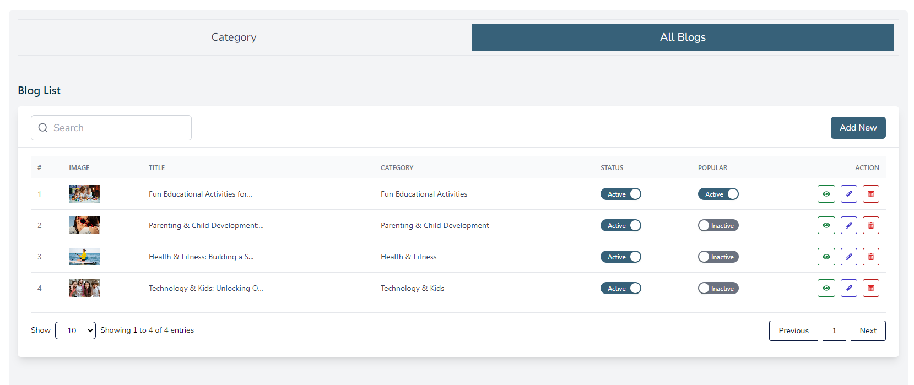
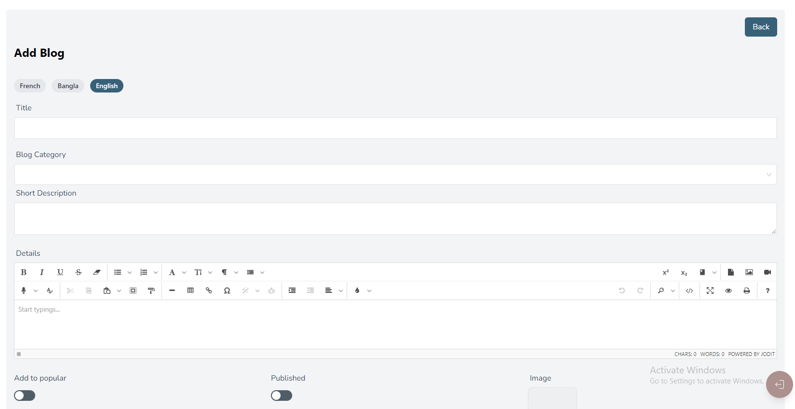
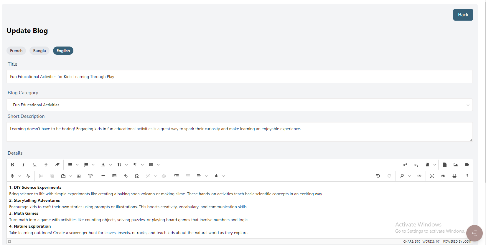
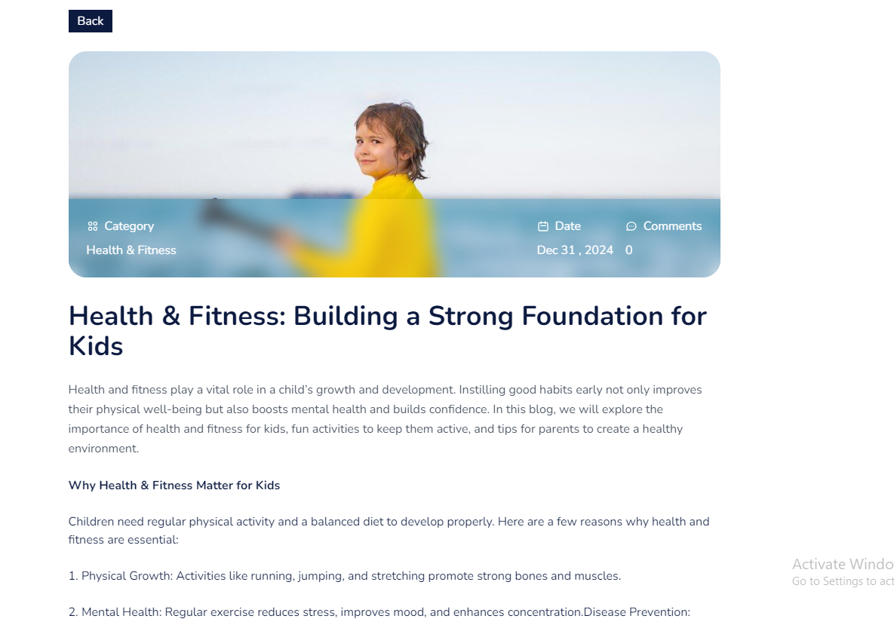
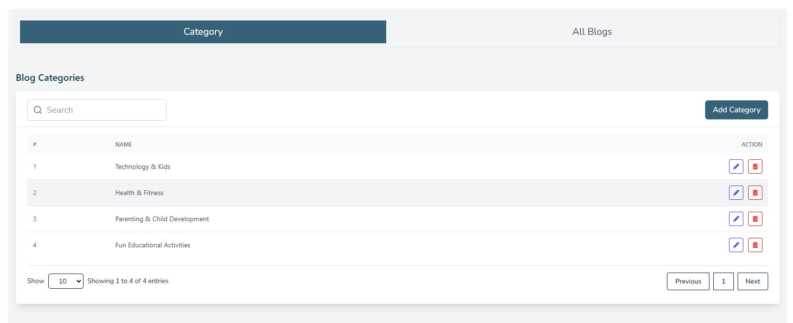
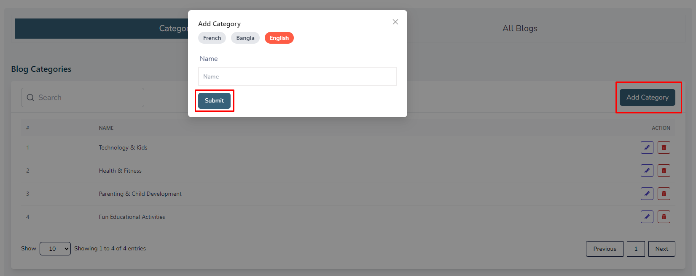
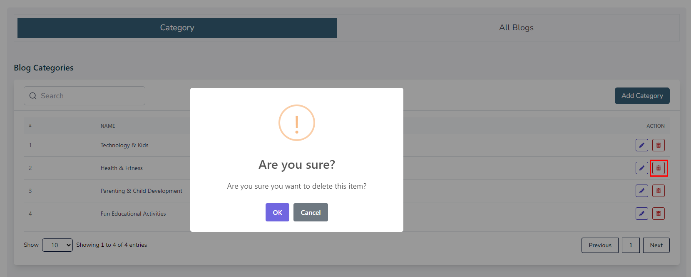

import React from 'react';
import Tabs from '@theme/Tabs';
import TabItem from '@theme/TabItem';

      <Tabs
        defaultValue="blog"
        values={[
          { label: 'Blog', value: 'blog' },
          { label: 'Category', value: 'category' },
        ]}
      >
        <TabItem value="blog">

# Blog

- In this section, the admin can create blogs for the site.
- The admin will be able to see all the existing blogs.
- Admin can search a specific blog by using the **search bar**.
- A blog can be kept active which means it will be displayed on the site, if it is kept inactive then it will not appear on the site.
- Activating the popular switch will highlight the specific blog.

## Here is how to add a new blog!

- To add a new blog, click on the **Add New** button. A form will appear where you can add a new blog.You can add blog multiple laguages .

- After adding the blog, click on the **Submit** button to submit the blog.
 

## Here is how to edit a blog!

- To edit a blog, click on the **Edit** button. 
- A form will appear where you can edit the blog.
- After editing the blog, click on the **Submit** button to submit the blog.

## Here is how you can see blog details!

- To see the details of a blog, click on the **View** button. 
- A page will appear where you can see the details of the blog.

        </TabItem>

        <TabItem value="category">

# Category

- In this section, the admin will be able to see all the existing categories and their key information.
- Admin can search a specific category by using the **search bar**.

## Here is how to add a new category!

- Admin can add a new category by clicking the **Add Category** button.

- After adding the category, click on the **Submit** button to submit the category.

## Here is how you can delete a category !

- Admin can delete a category by clicking the **Delete** action button.

        </TabItem>
      </Tabs>