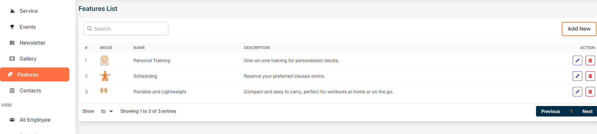
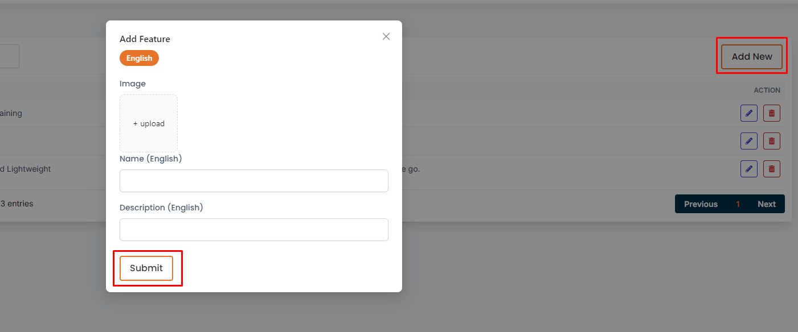
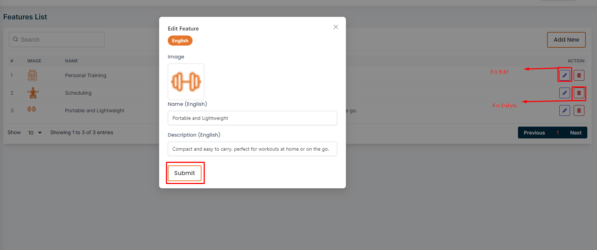

# Feature

- In this section, the admin can create features for users that can be used in the site .

- This is the features page where admin can see all the existing features.

- Admin can search a specific product by using the **search bar**.

## Here is how to add a new feature!

- To add a new feature, click on the **Add Feature** button. Fill all the required fields and click on the **Submit** button to save the feature.

## Here is how to edit and delete a feature!

- To edit a feature, click on the **Edit** action button. A form will appear where you can edit the feature.After editing the feature, click on the **Submit** button to Submit the feature.

- To delete a feature, click the **Delete** action button.

!
