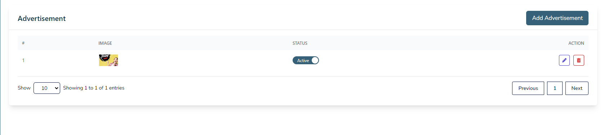
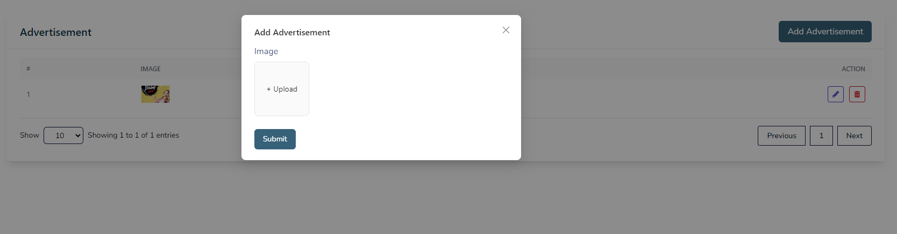
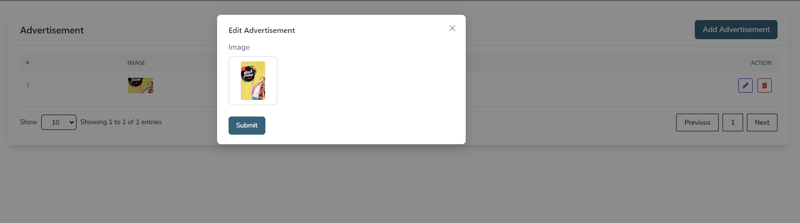
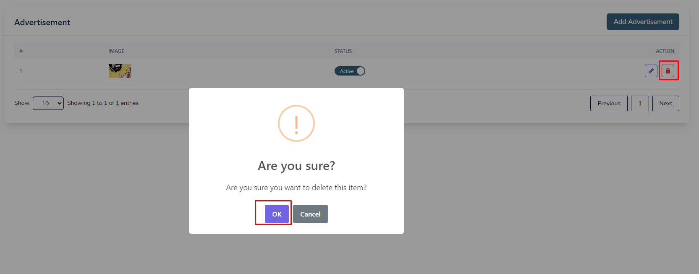

# Advertisement

- In this section, the admin will be able to see all the existing advertisements and their key information.

- Admin can Publish or Unpublish an advertisement by using the **status** switch.

- Admin can advertise anything by his website by createing an advertisement poster.

## Here  is how you can create an advertisement poster !

- To create an advertisement poster, click on the **Add Advertisement** button.
- A form will appear where you can add an advertisement poster.
- After adding the advertisement poster, click on the **Submit** button to Submit the advertisement poster.
- After activating the advertisement poster, it will be displayed on the site.
- You can activate advertisement poster only one at a time.

## Here is how you can edit an advertisement poster!

- To edit an advertisement poster, click on the **Edit** action button.
- A form will appear where you can edit the advertisement poster.
- After editing the advertisement poster, click on the **submit** button to Submit the advertisement poster.

## Here is how you can delete an advertisement poster!

- To delete an advertisement poster, click on the **Delete** action button.

