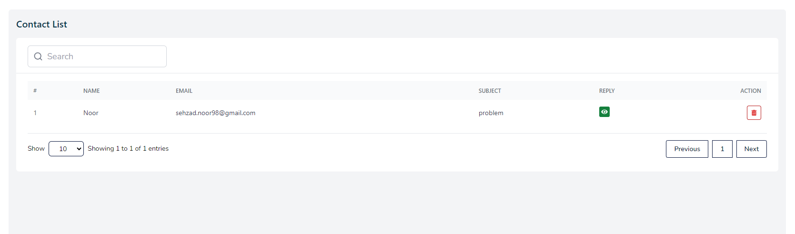
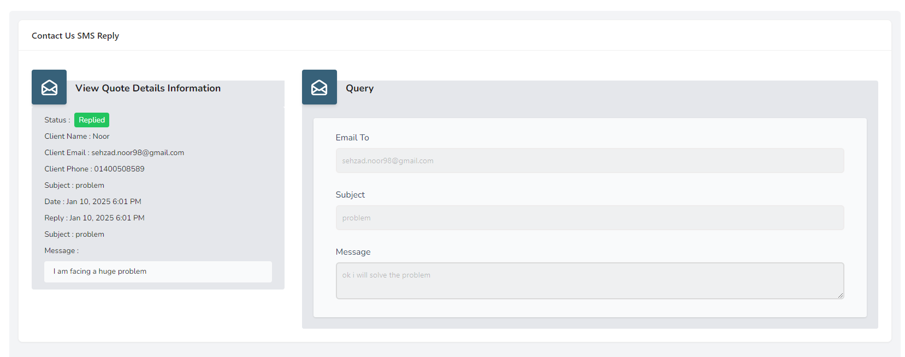
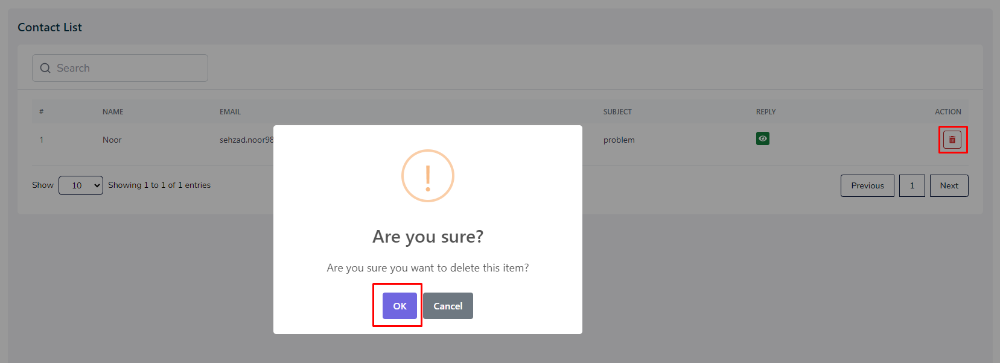

# Contact

- In this section, the admin will be able to see a list of users that has contacted the admin.
- Admin can delete any user contact using the **Action buttons**.
- Admin can search a specific user by using the **search bar** .

- The admin can reply the user by clicking the **reply** button.
- Once replied, the button will change into view mode which indicates that the admin as already replied the user.
- Clicking the **view** button will take the admin to the following window.

- The admin can delete the user contact by clicking the **Delete** button.

