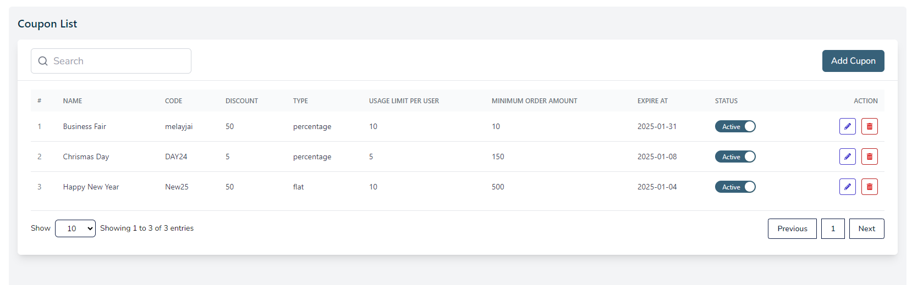
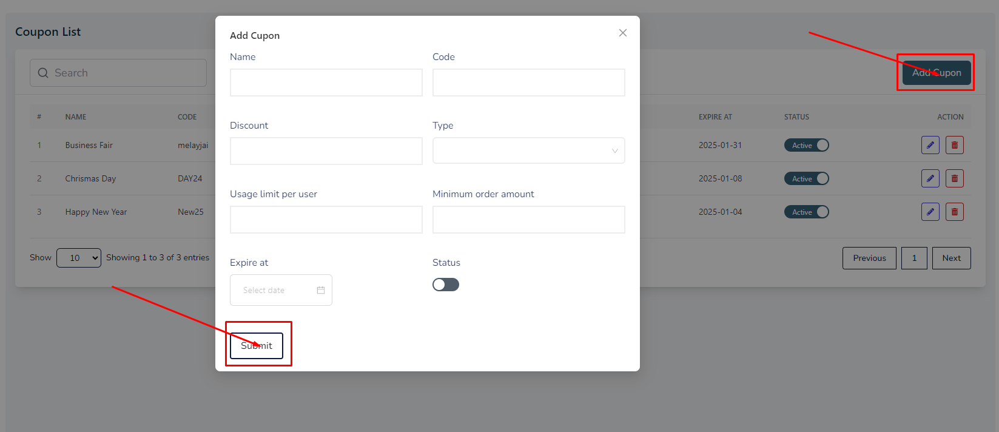
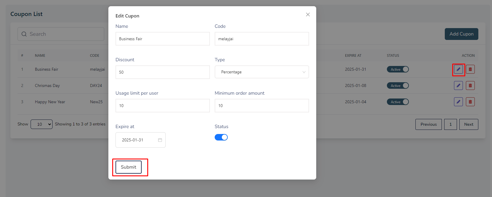
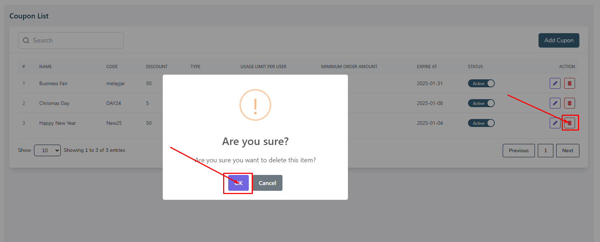

# Coupon

- In this section, the admin can create coupons for products to offer discounts.

- This is the coupon list page where admin can see all the existing coupons. Admin can search a specific coupon by using the **search bar** .

- clicking on the switch **inactive** button to publish the coupon.

# Here is how to add a new coupon?

- To add a new coupon, click on the **Add Coupon** button. Fill all the required fields and click on the **Submit** button to save the coupon.

# Here is how to edit a coupon?

- To edit a coupon, click on the **Edit** action button. A form will appear where you can edit the coupon.After editing the coupon, click on the **Submit** button to Submit the coupon.To 

## Here is how to delete a coupon?

- To delete a coupon, click on the **Delete** action button. 
- A confirmation dialog will appear where you can confirm the deletion of the coupon.

