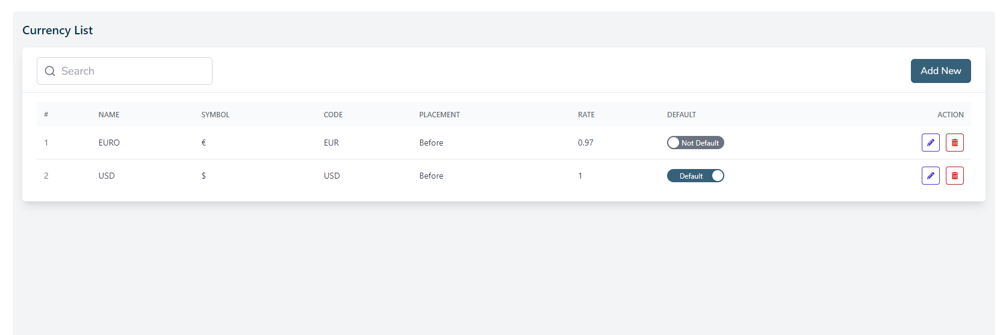
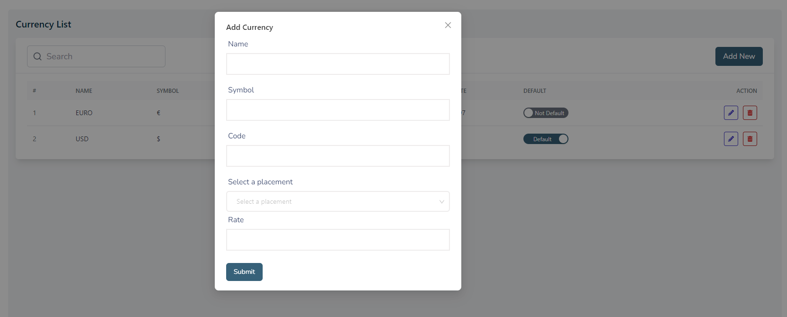
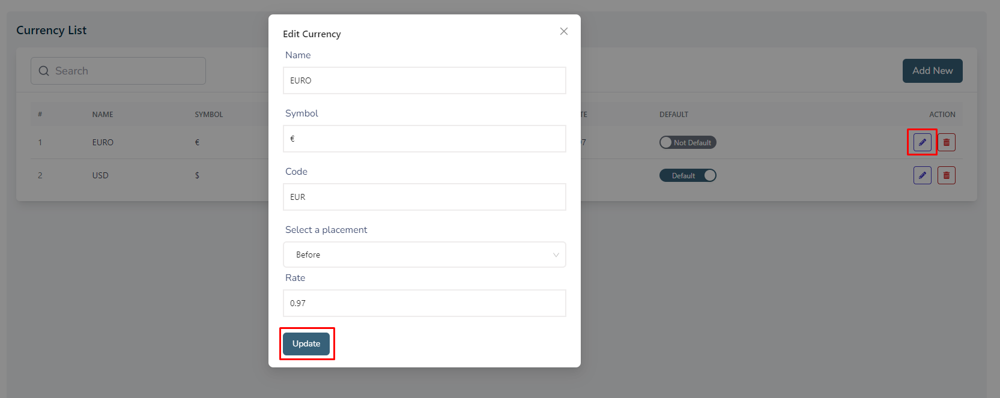
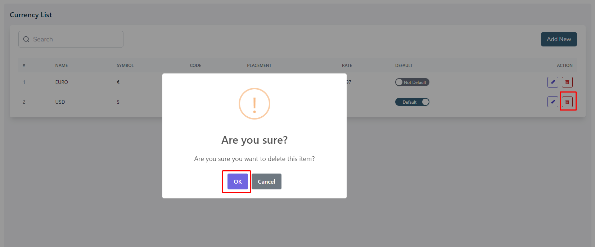

# Currencies

- This is the currency page where admin can see all the existing currencies.

- Admin can search a specific currency by using the **search bar**.

- Admin can delete or edit using the **Action buttons** and see the active status and change status.

## Here is how to add a new currency!

- To add a new currency, click on the **Add New** button. 
- Fill all the required fields and click on the **Submit** button to save the currency.

## Here is how to edit a currency!

- To edit a currency, click on the **Edit** action button.
- A form will appear where you can edit the currency.
- After editing the currency, click on the **update** button to Submit the currency.

## Here is how to delete a currency!

- To delete a currency, click on the **Delete** action button.
- A confirmation dialog will appear where you can confirm the deletion of the currency.

