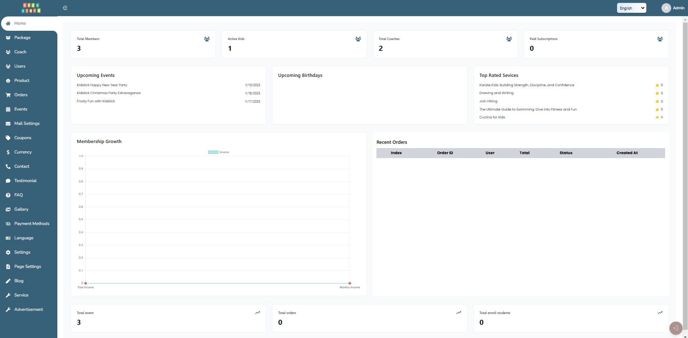

# Dashboard Overview

## Total Users
- **Number of Users registered on the platform**
  - This metric indicates the total count of all users who have signed up and registered on the platform. It includes everyone who has created an account, regardless of their role or activity status.

## Total Coachs
- **Number of coachs registered on the platform**
  - This metric shows the total number of coachs who have registered on the platform. Coachs are users who provide training or coaching services, and this count helps gauge the availability of training resources.

## Total Events
- **Number of events registered on the platform**
  - This metric displays the total number of events created on the platform. Events can be organized for various purposes, such as training sessions, workshops, or community gatherings, and this count indicates the level of user engagement and activity.

## Total Services
- **Number of services registered on the platform**
  - This metric shows the total number of services created on the platform. Services can be formed for various purposes, such as training sessions, discussions, or community building, and this count indicates the level of user engagement and interaction.

