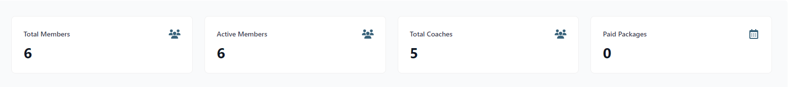
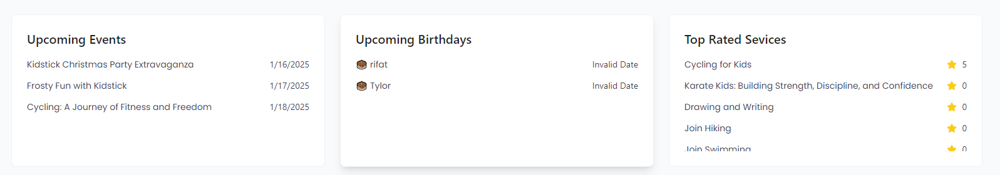
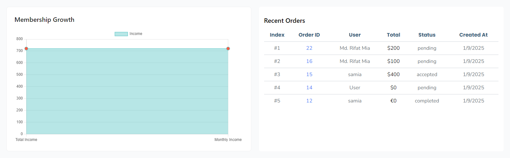
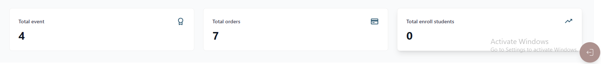

# Dashboard Overview

## Total Users
- **Number of Users registered on the platform**
  - This metric indicates the total count of all users who have signed up and registered on the platform. It includes everyone who has created an account, regardless of their role or activity status.

## Total Coachs
- **Number of coachs registered on the platform**
  - This metric shows the total number of coachs who have registered on the platform. Coachs are users who provide training or coaching services, and this count helps gauge the availability of training resources.

## Total Events
- **Number of events registered on the platform**
  - This metric displays the total number of events created on the platform. Events can be organized for various purposes, such as training sessions, workshops, or community gatherings, and this count indicates the level of user engagement and activity.

## Paid Packages

- **Number of packages registered on the platform**
  - This metric shows the total number of paid packages created on the platform. Paid packages provide access to training resources, and this count helps gauge the availability of training resources. 

## Upcoming Events

- In this section, the admin will be able to see the events that will be happening in the coming days.

## Upcoming Birthdays

- In this section, the admin will be able to see the birthdays of the users that will be happening in the coming days.

## Top Rated Sevices

- In this section, the admin will be able to see the top rated services.

## Membership Growth

- In this section, the admin will be able to see the membership growth.
- The membership growth is the number of new users who have joined the platform in a specific period of time.
- It is calculated by total income and monthly membership growth.

## Recent Orders

- In this section, the admin will be able to see the recent orders.
- This section displays a list of recent orders, including order details, status, and date, allowing the admin to quickly review and manage orders.

## Total Events

- **Number of events registered on the platform**
  - This metric shows total number of events created on the platform. Events can be organized for various purposes, such as training sessions, workshops, or community gatherings, and this count indicates the level of user engagement and activity.

## Total orders

- **Number of orders registered on the platform**
  - This metric shows total number of orders created on the platform. Orders can be made by users to purchase products or services, and this count indicates the level of user engagement and activity.

## Total enroll students

- **Number of enroll students registered on the platform**
  - This metric shows total number of enroll students created on the platform. Enroll students can join a course or program, and this count indicates the level of user engagement and activity.

