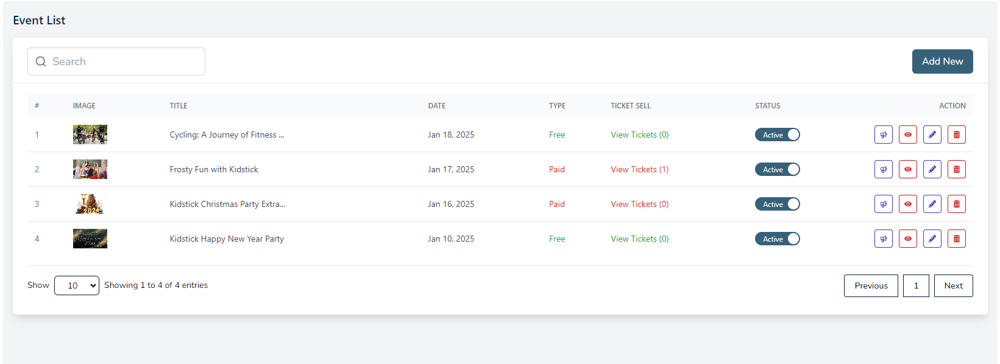
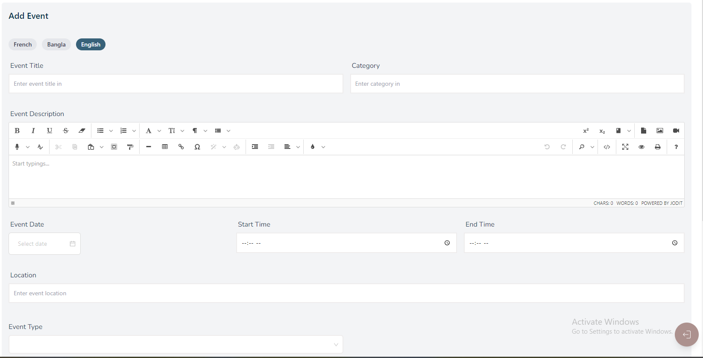
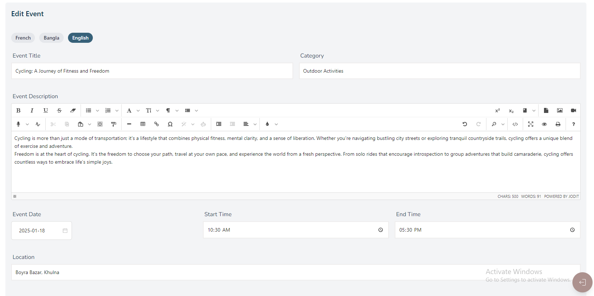
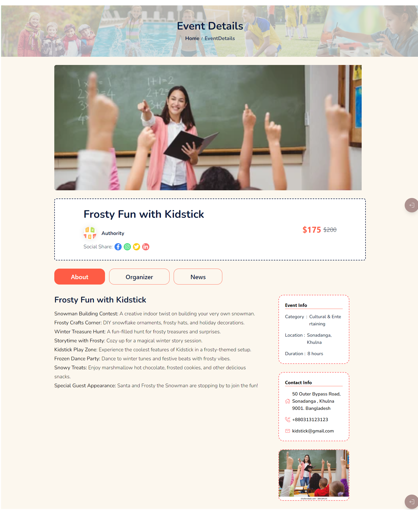
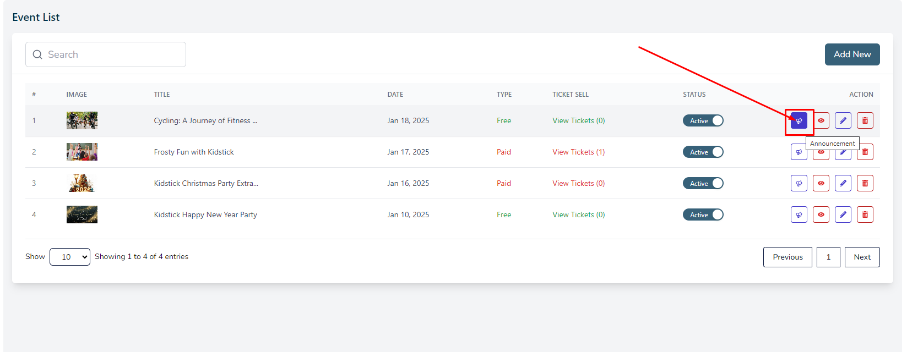
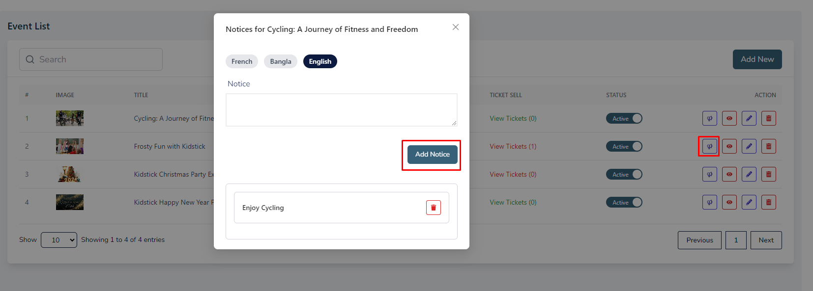

# Events

- In this section, the admin will be able to see all the existing events and their key information.

- Admin can search a specific event by using the **search bar**.

## Here is how to add a new event!

- To add a new event, click on the **Add New** button. 

-A form will appear where you can add a new event.

- After adding the event, click on the **Create Event** button to submit the event. 

- You can add event multiple laguages.

## Here is how to edit a event!

- To edit a event, click on the **Edit** action button. 

-A form will appear where you can edit the event.

-After editing the event, click on the **Update Event** button to submit the event.

  

## Here is how to see Event Details !

- To see the details of an event, click on the **View** action button.

- A page will open with the details of the event.

## Here is how to send a notice to announce an event!

- To send a notice, click on the **Announce** action button.

- A form will appear where you can send a notice.

- After sending the notice, click on the **Add Notice** button to submit the notice.

