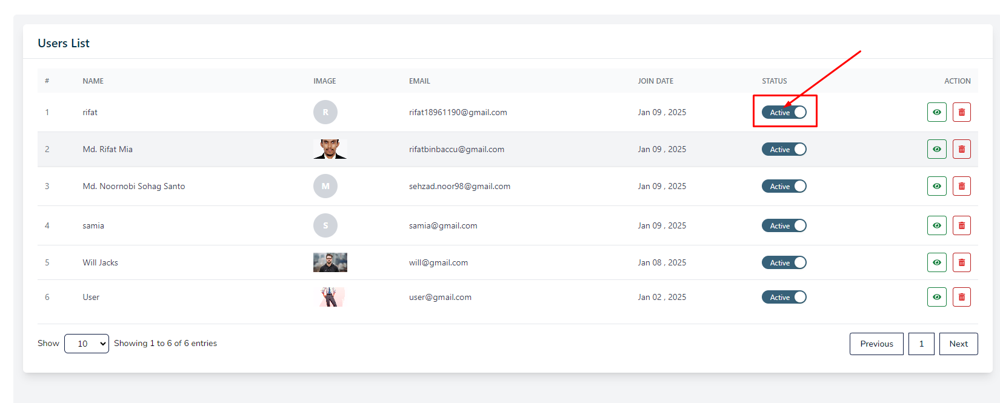
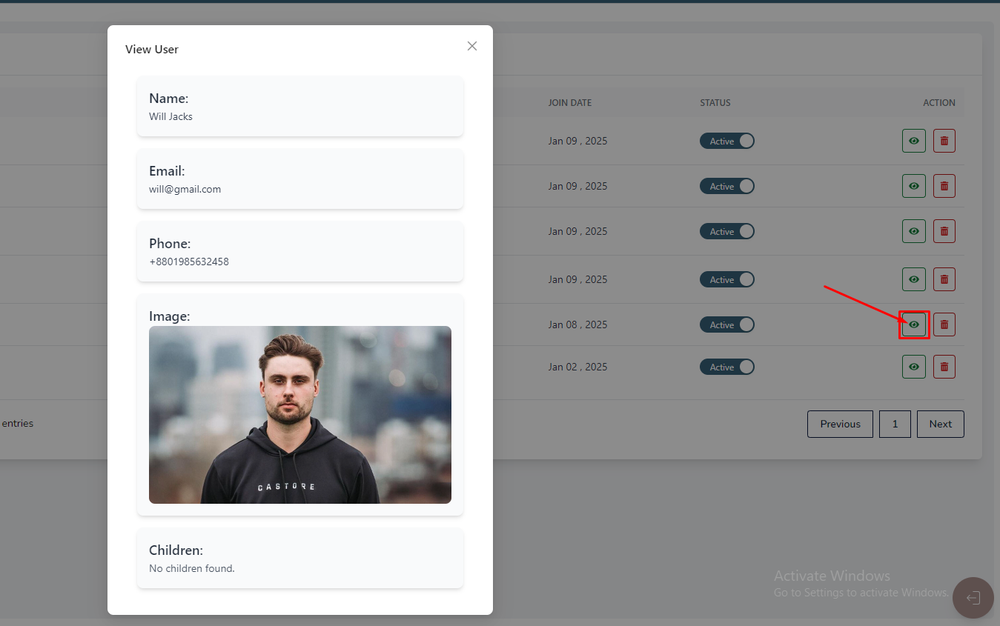
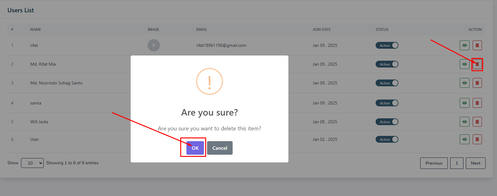

# Users

- In this section, the admin will be able to see all the existing users and their key information. 

- Admin can Active or Inactive a user by using the **status** switch.

## Here is how to see User Details !

- To see the details of a user, click on the **View** action button. 

- A modal will appear where you can see the details of the user.

## Here is how to delete a user!

- To delete a user, click on the **Delete** action button. A confirmation dialog will appear where you can confirm the deletion of the user.

