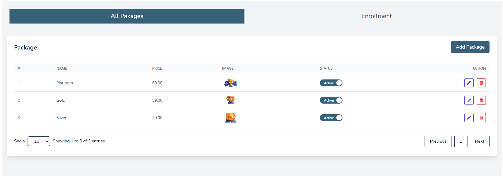
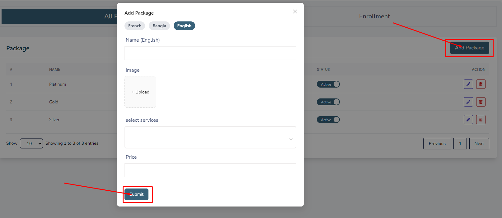
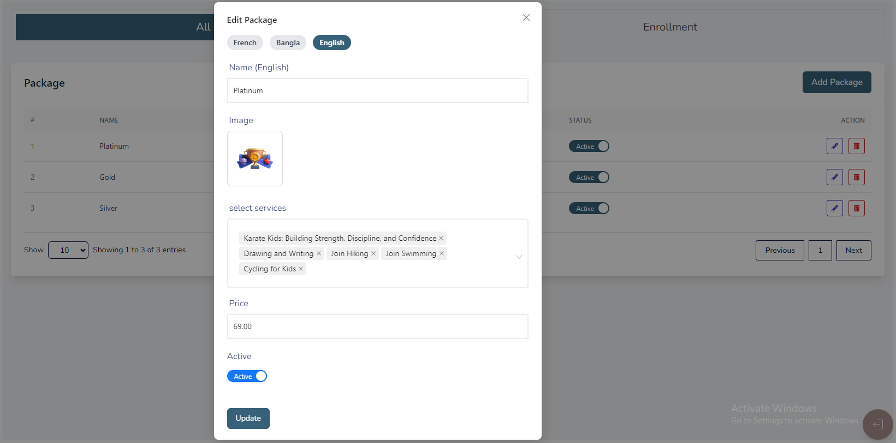
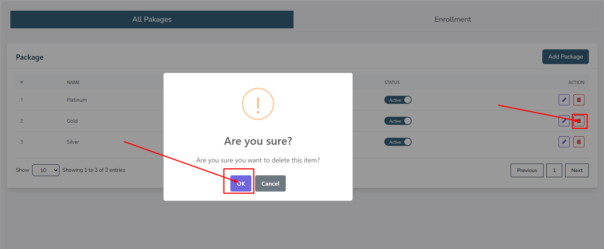
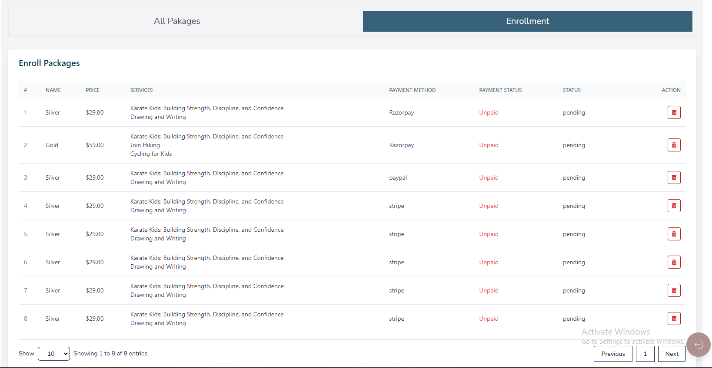
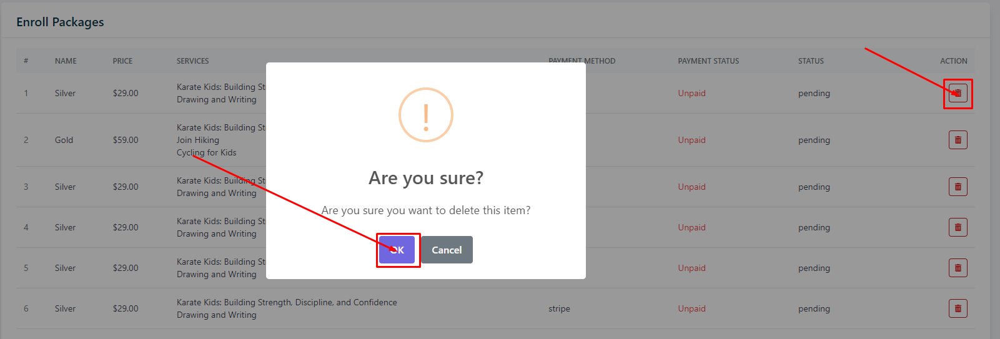

import React from 'react';
import Tabs from '@theme/Tabs';
import TabItem from '@theme/TabItem';

      <Tabs
        defaultValue="packages"
        values={[
          { label: 'Packages', value: 'packages' },
          { label: 'Enrollment', value: 'enrollment' },
        ]}
      >
        <TabItem value="packages">

          # Packages

          - In this section, the admin can create packages for the site.
          - The admin will be able to see all the existing packages.

          

          ## Here is how to add a new package!

          - To add a new package, click on the **Add Package** button.
          - A form will appear where you can fill the required details.
          - You can add package multiple languages.
          - After filling all the details, click on the **Submit** button to submit the package.

          

          ## Here is how to edit a package!

          - To edit a package, click on the **Edit** action button.
          - A form will appear where you can edit the package.
          - After editing the package, click on the **Update** button to submit the package.

          

          ## Here is how to delete a package!

          - To delete a package, click on the **Delete** action button.

          
        </TabItem>

        <TabItem value="enrollment">
          # Enrollment

          - In this section, the admin will be able to see all the existing enrollments list.

          

          ## Here is how to delete an enrollment!

          - To delete an enrollment, click on the **Delete** action button.

          
        </TabItem>
      </Tabs>
