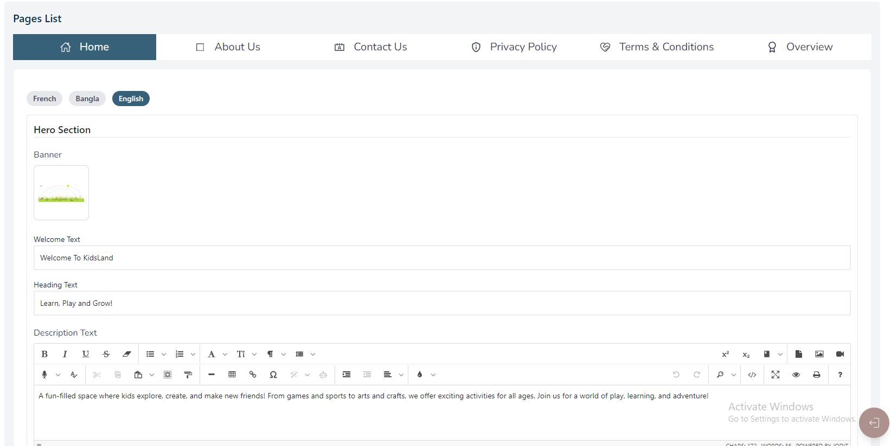
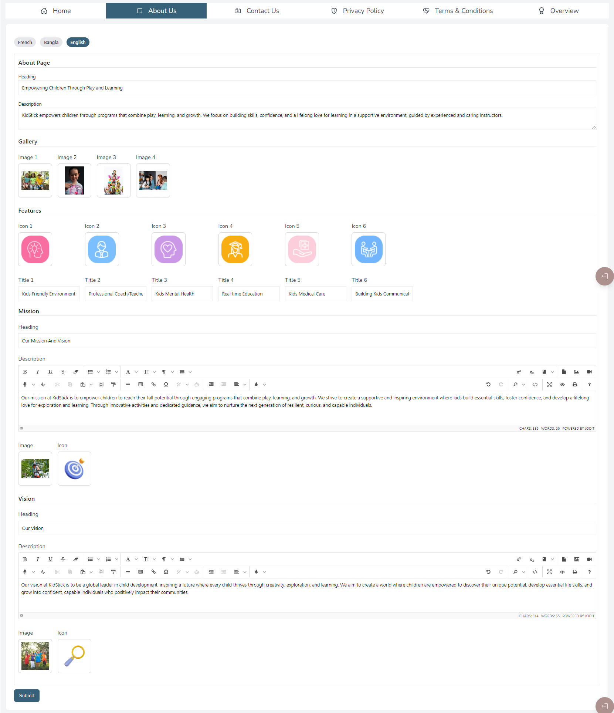
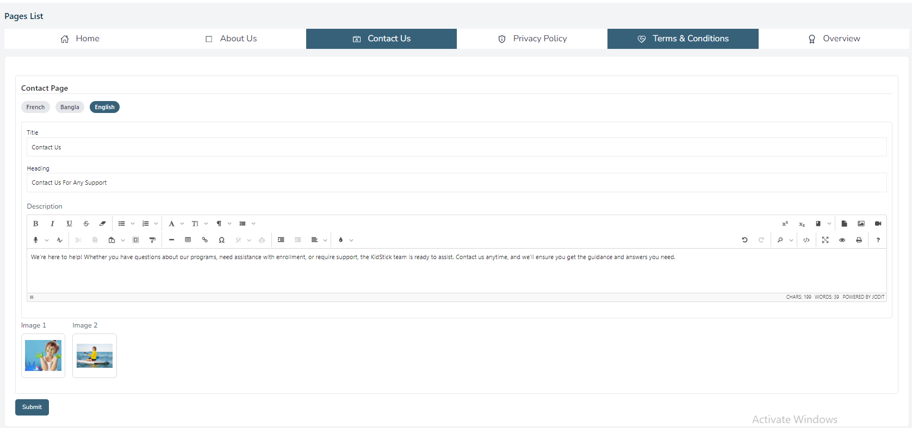
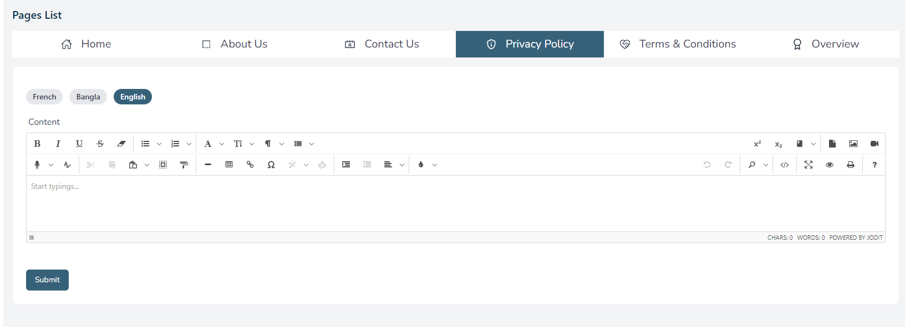
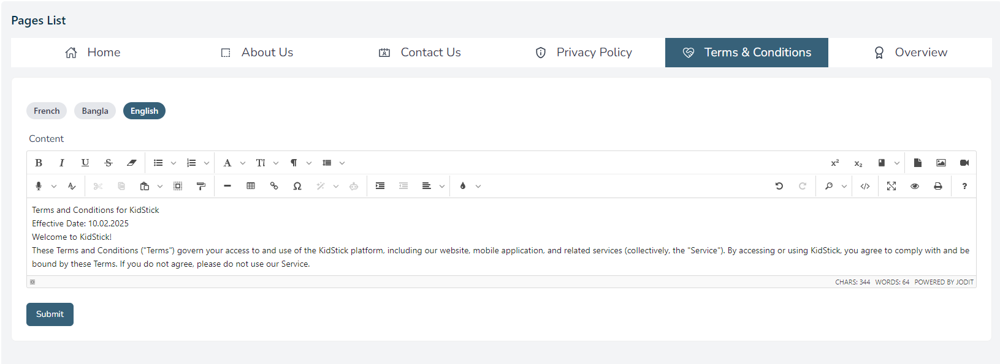
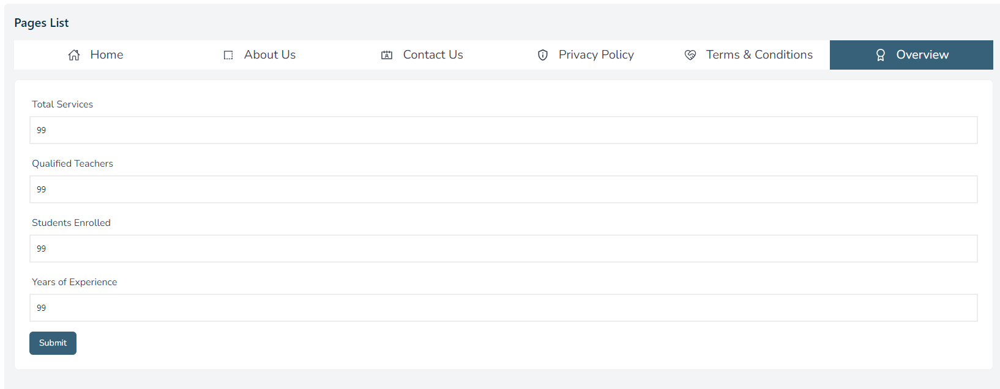

import React from 'react';
import Tabs from '@theme/Tabs';
import TabItem from '@theme/TabItem';

      <Tabs
        defaultValue="home"
        values={[
          { label: 'Home', value: 'home' },
          { label: 'About', value: 'about' },
          { label: 'Contact', value: 'contact' },
          { label: 'privacy policy', value: 'privacy' },
          { label: 'Terms & Conditions', value: 'terms' },
          { label: 'overview', value: 'overview' },
        ]}
      >
        <TabItem value="home">

# Home Page

- In this section, the admin will be able to see home page and all the existing sections and their key information.

- Admin can change it according to his requirement.
- All sections in home page are dynamic.
- Admin can change it in this page.

        </TabItem>

        <TabItem value="about">

# About Page

- In this section, the admin will be able to see all the existing products and their key information.

- Admin can change it according to his requirement.
- All sections in about page are dynamic.
- Admin can change it in this page.

        </TabItem>

        <TabItem value="contact">

# Contact Page

- In this section, the admin will be able to see all the existing products and their key information.

- Admin can change it according to his requirement.
- All sections in contact page are dynamic.
- Admin can change it in this page.

        </TabItem>

        <TabItem value="privacy">

# Privacy Policy

- In this section, the admin will be able to see all the existing products and their key information.

- Admin can change it according to his requirement.

- Admin can change it in this page.

        </TabItem>

        <TabItem value="terms">

# Terms & Conditions

- In this section, the admin will be able to see all the existing products and their key information.

- Admin can change it according to his requirement.

- Admin can change it in this page.

        </TabItem>

        <TabItem value="overview">

# Overview

- In this section, the admin will be able to see all the existing products and their key information.

- Admin can change it according to his requirement.

- Admin can change it in this page.

        </TabItem>

      </Tabs>

