import React from 'react';
import Tabs from '@theme/Tabs';
import TabItem from '@theme/TabItem';

      <Tabs
        defaultValue="product"
        values={[
          { label: 'Product', value: 'product' },
          { label: 'Category', value: 'category' },
        ]}
      >
        <TabItem value="product">

# Products

- In this section, the admin will be able to see all the existing products and their key information.

- Admin can Publish or Unpublish a product by using the **status** switch.

- Admin can search a specific product by using the **search bar**.

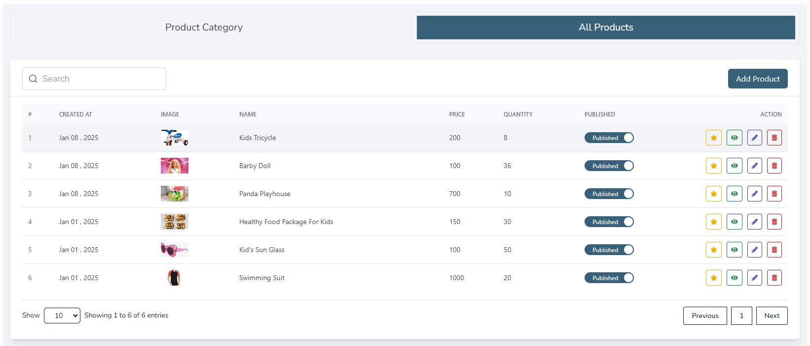

## Here is how to add a new product!

- Admin can add a new product by clicking the **Add Product** button.

- A form will appear where admin fill the required details and click the **Submit** button to submit the product.

- Admin can add product multiple laguages.

- Admin can add product multiple variants.

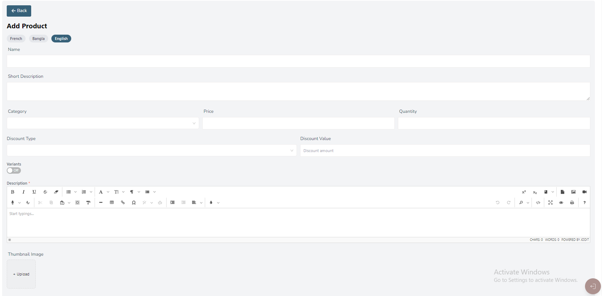    

## Here is how to edit a product!

- Admin can edit a product by clicking the **Edit** action button.

- A form will appear where admin fill the required details and click the **Submit** button to submit the product.

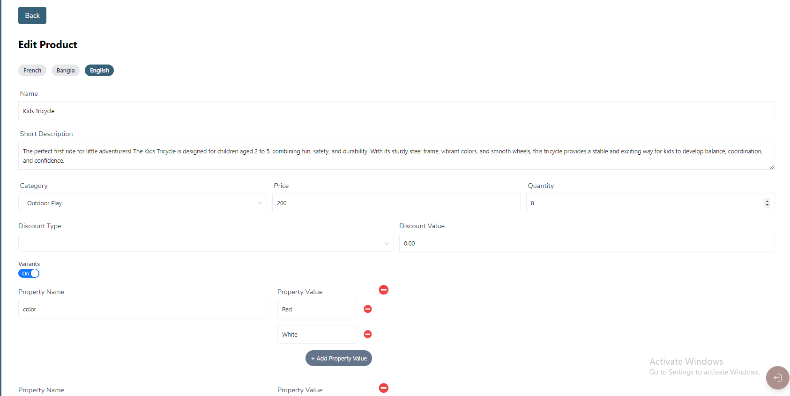

## Here is how to view a product detail!

- Admin can view a product detail by clicking the **View** action button.

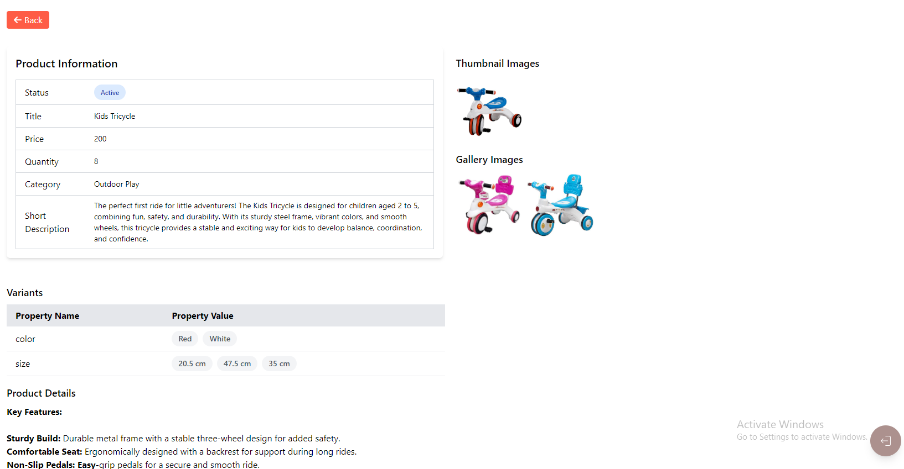

## Here is how you can see product reviews !

- Admin can see product details by clicking the **Review** action button.
- Admin can delete reviews by clicking the **Delete** action button.

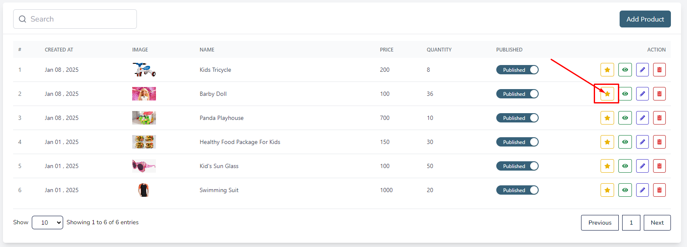

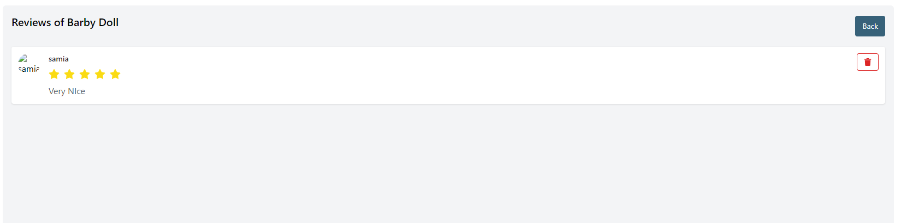

## Here is how to delete a product!

- Admin can delete a product by clicking the **Delete** action button.

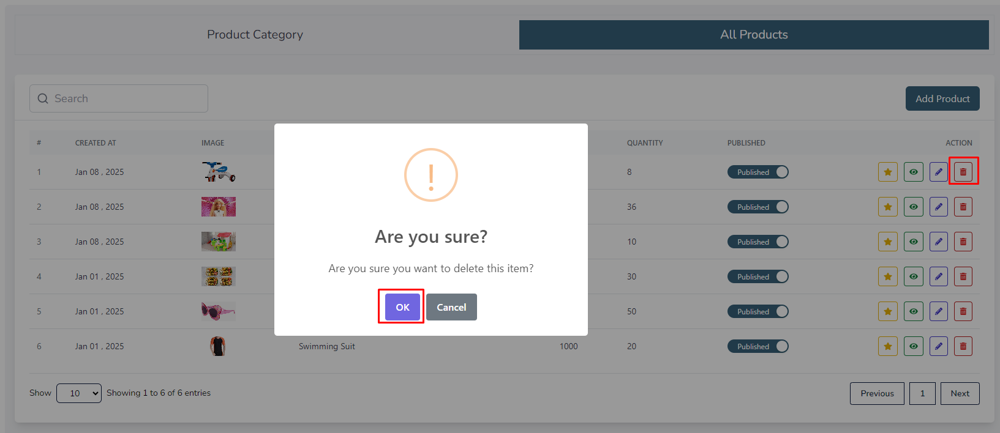

        </TabItem>

        <TabItem value="category">

# Categories

- In this section, the admin will be able to see all the existing categories and their key information.
- Admin can search a specific category by using the **search bar**.

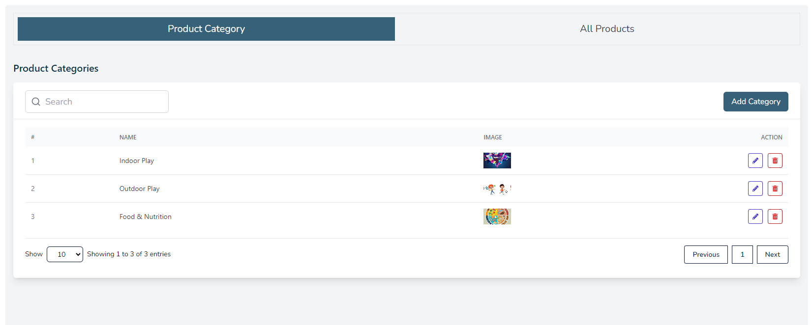

## Here is how to add a new category!

- Admin can add a new category by clicking the **Add Category** button.

- A form will appear where admin fill the required details and click the **Submit** button to submit the category.

- Admin can search a specific category by using the **search bar**.

- Admin can add category multiple laguages.

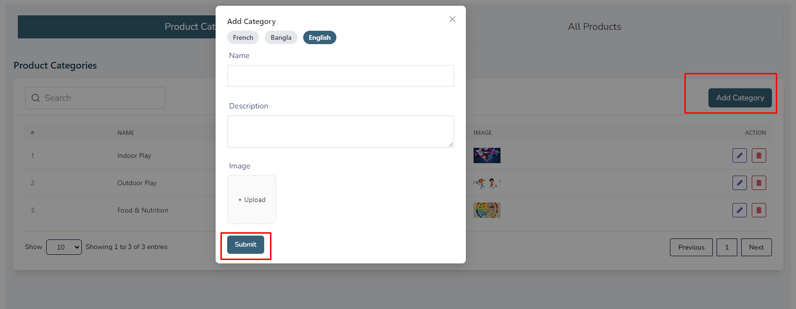

## Here is how to edit a category!

- Admin can edit a category by clicking the **Edit** action button.

- A form will appear where admin fill the required details and click the **Submit** button to submit the category.

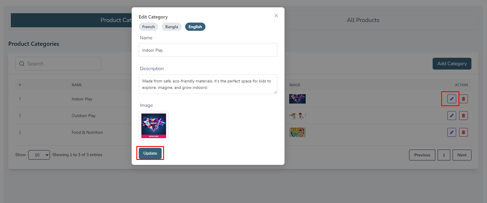

## Here is how to delete a category!

- Admin can delete a category by clicking the **Delete** action button.

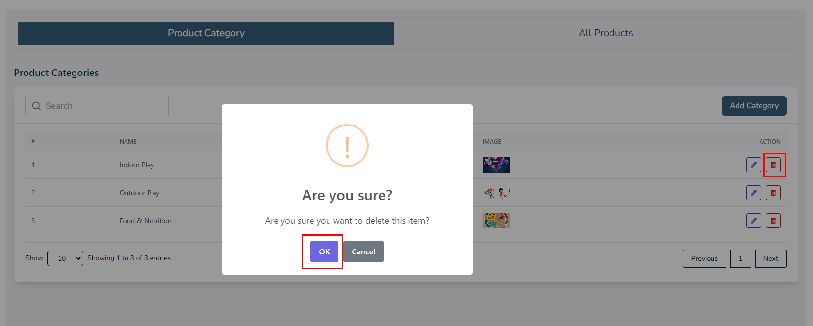 

        </TabItem>
      </Tabs>