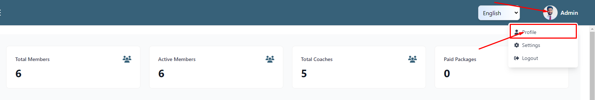
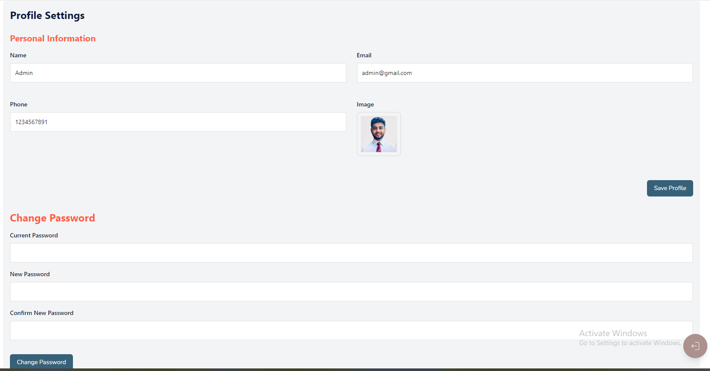
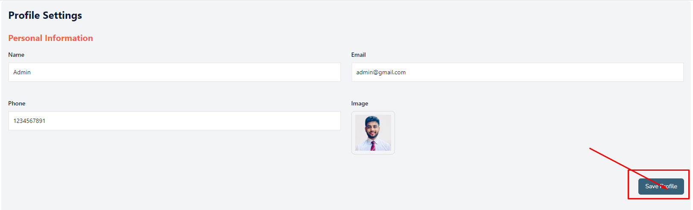
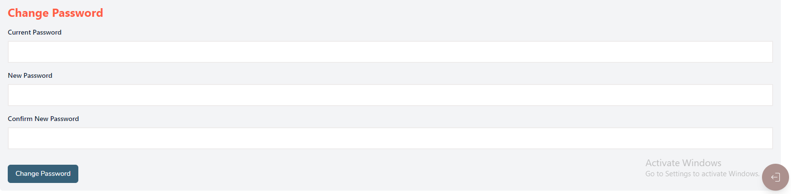

# Profile

- Clicking on Profile, admin will be able to see his profile details setting.

## Profile Details

- Clicking on Profile, admin will be able to see his profile details setting.

## Here is how you can update your profile details !

- Admin can update his profile details and clicking on the **Save profile** button to update the profile details.

## Here is how you can change your password !

- Admin can change his password by fill the current password and new password and clicking on the **Change Password** button to update the password.

