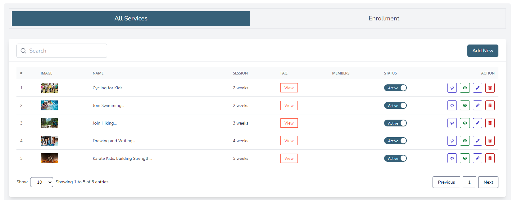
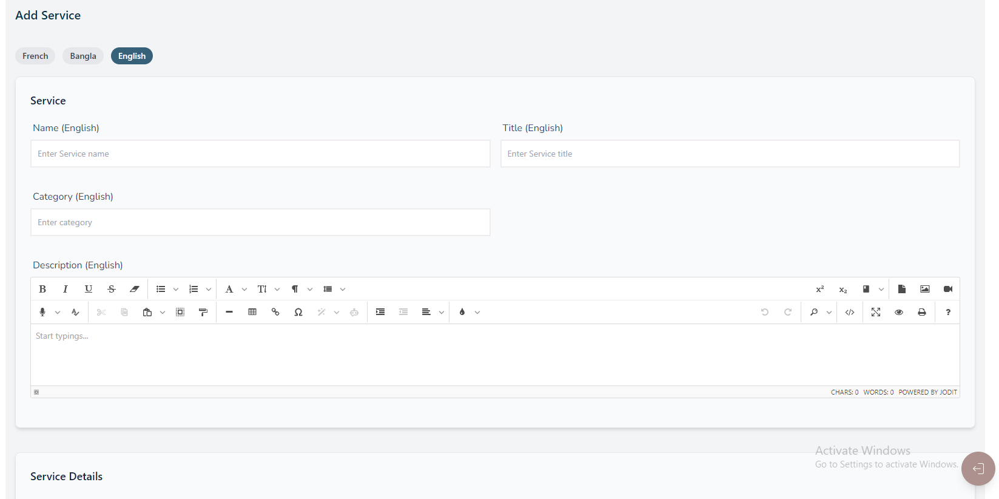
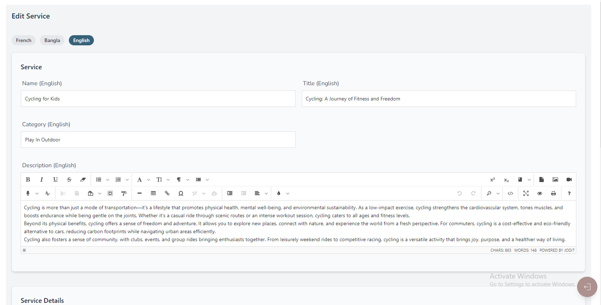
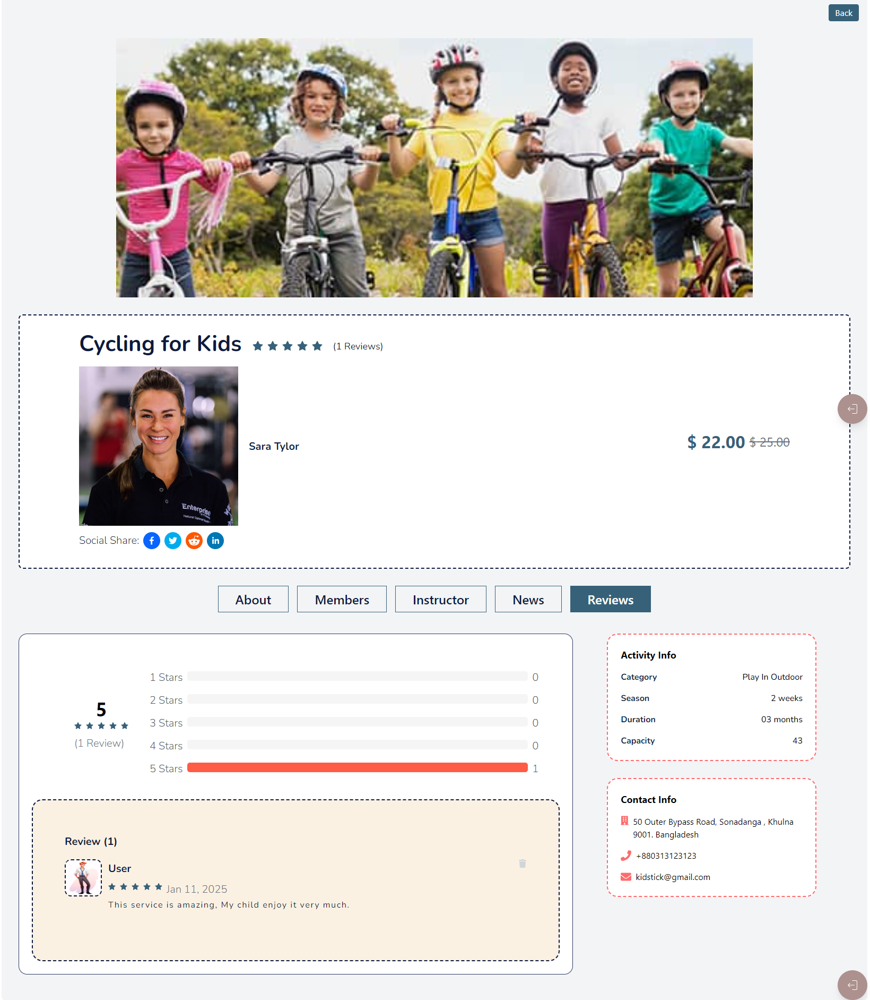
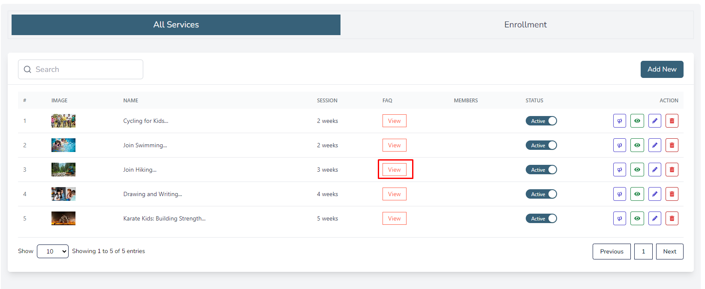
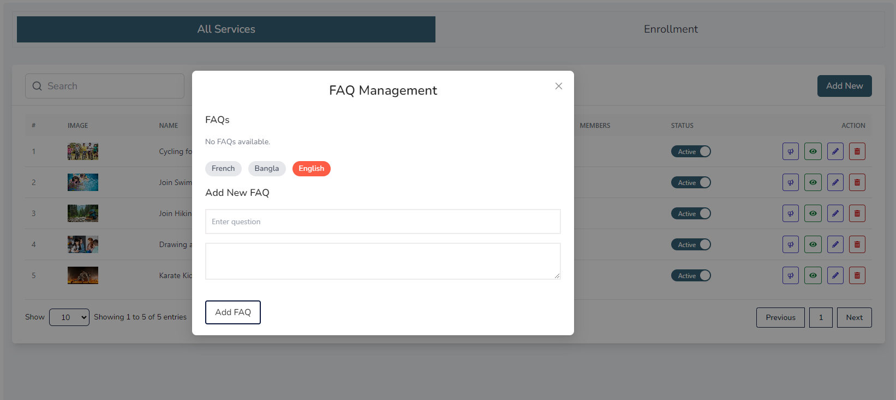
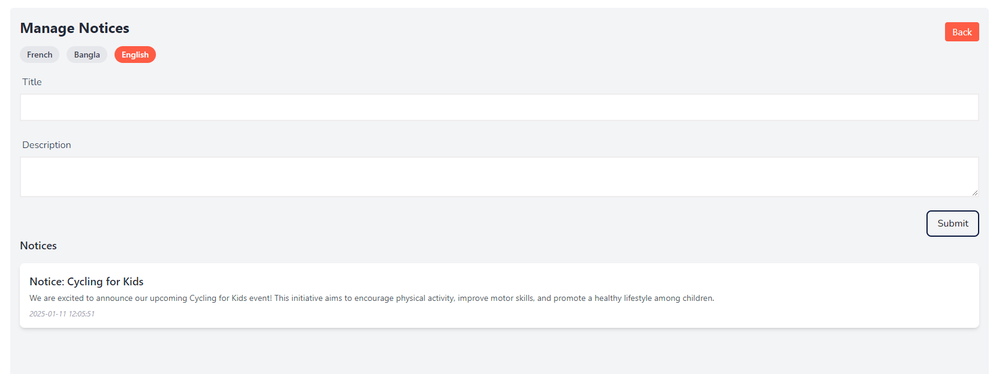
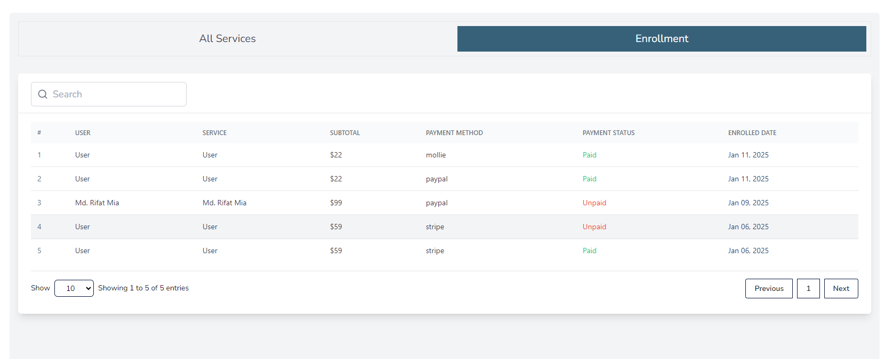

import React from 'react';
import Tabs from '@theme/Tabs';
import TabItem from '@theme/TabItem';

      <Tabs
        defaultValue="service"
        values={[
          { label: 'Service', value: 'service' },
          { label: 'Enrollment', value: 'enrollment' },
        ]}
      >
        <TabItem value="service">

# Services

- In this section, the admin will be able to see all the existing services and their key information.

- Admin can Publish or Unpublish a service by using the **status** switch.

- Admin can search a specific service by using the **search bar**.

## Here is how to add a new service!

- Admin can add a new service by clicking the **Add New** button.
- A page will open where admin can add a new service.
- A form will be displayed then fill all the required fields and click on the **Submit** button to save the service.

## Here is how to edit a service!

- Admin can edit a service by clicking the **Edit** action button.
- A page will open where admin can edit the services according to his requirement.
- After editing the service, click on the **Update service** button to save the service.

## Here is how to see a service detail?

- To see a service detail, click on the service name. 
- You will be redirected to the service detail page.

## Here is how to see faq and create a faq?

- To see faq and create a faq, click on the **View** button.
- You can see a list of FAQs.
- To add a new FAQ, click on the **Add New** button.

## Here is how you can send a announcement !

- To send a announcement, click on the **Announcement** action button.
- A form will be displayed then fill all the required fields and click on the **Submit** button to send the announcement.

        </TabItem>

        <TabItem value="enrollment">

# Enrollment

- In this section, the admin can view the complete list of user enrollments.

- Admin can search a specific service by using the **search bar**.

</TabItem>

</Tabs>