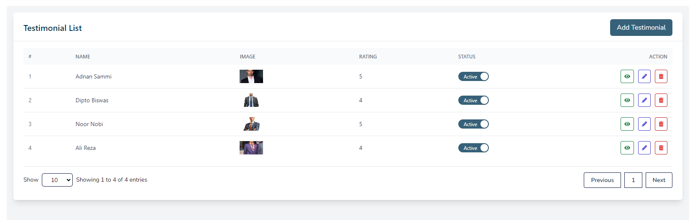
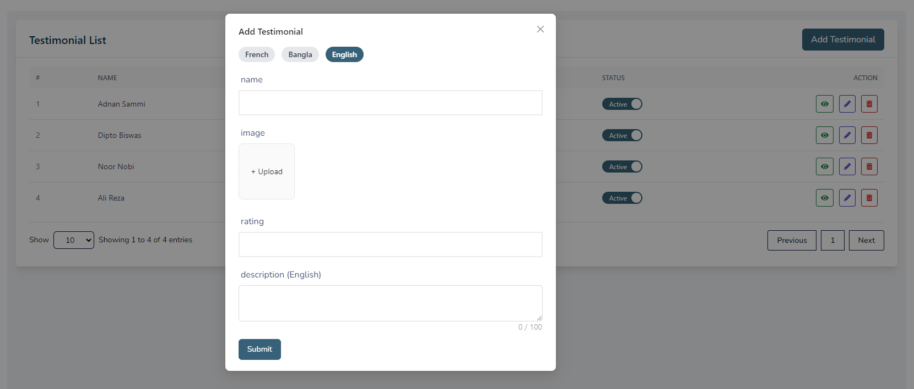
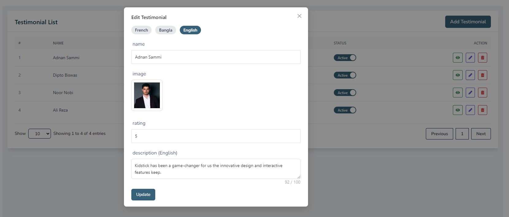
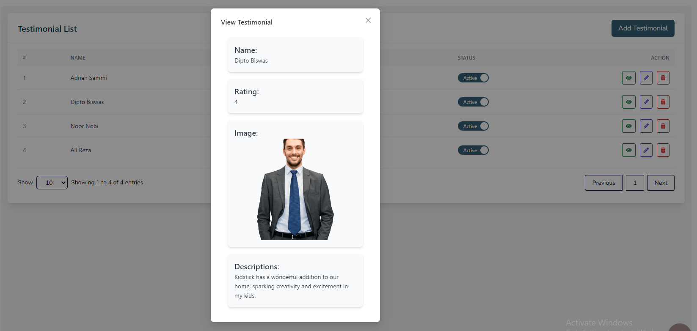
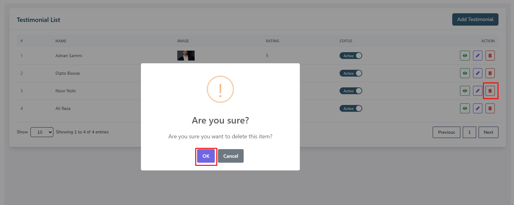

# Testimonials

- In this section, the admin will be able to see all the existing testimonials and their key information.

- Admin can change the status of a testimonial by using the **status** switch.

## Here is how to add a new testimonial!

- To add a new testimonial, click on the **Add Testimonial** button. 

- Fill all the required fields and click on the **Submit** button to save the testimonial.

## Here is how to edit a testimonial!

- To edit a testimonial, click on the **Edit** action button.

- A form will appear where you can edit the testimonial.
- After editing the testimonial, click on the **update** button to submit the testimonial.

## Here is how to view a testimonial?

- To view a testimonial, click on the **View** action button.

- A page will open with the details of the testimonial.

## Here is how to delete a testimonial?

- To delete a testimonial, click on the **Delete** action button.

- A confirmation dialog will appear where you can confirm the deletion of the testimonial.

