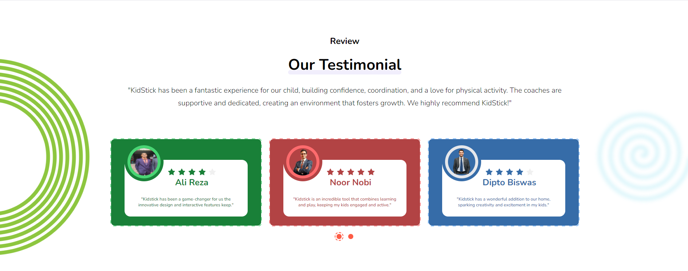
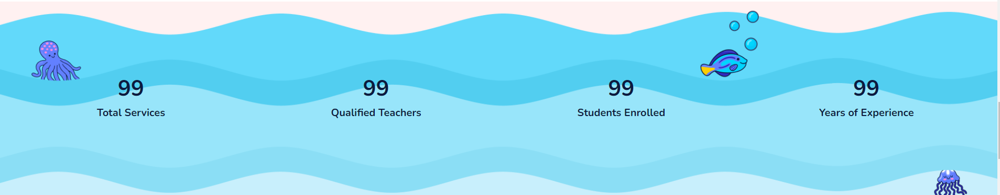
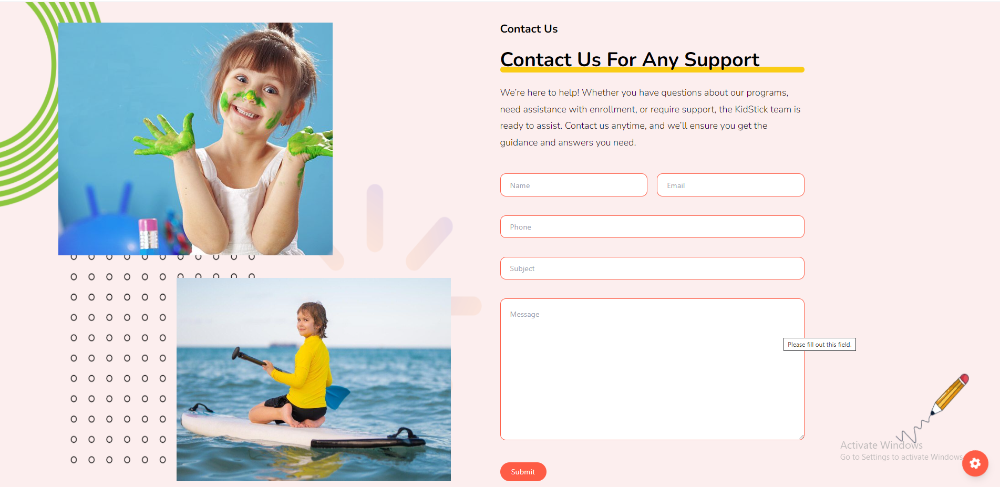
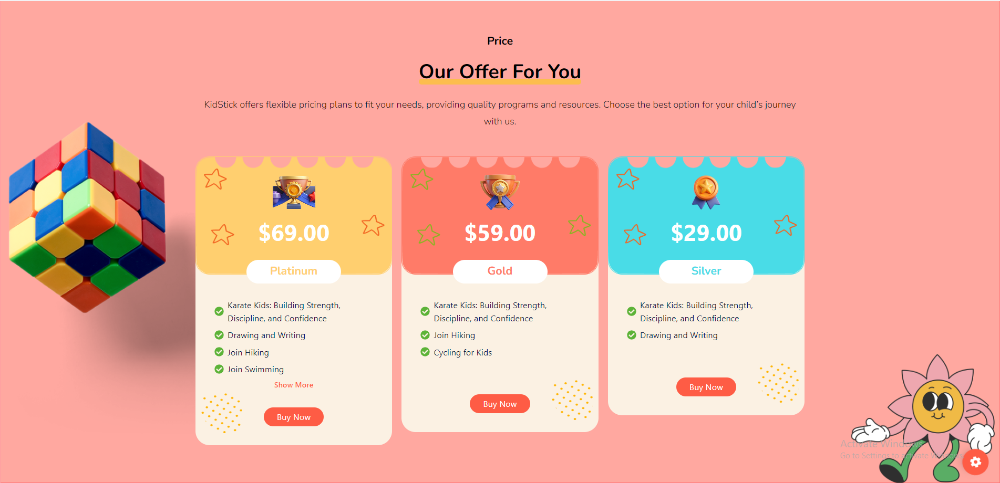

# About Us

- In this section, anyone can see the about us section photo and content, here all the sections are dynamic. 

- You can change it according to your requirement.

- The admin can modify it through the **page setting** page in the admin panel.

## Our work 

- In this section, anyone can see the our work section photo and content, here all the sections are dynamic.

- You can change it according to your requirement.

- The admin can modify it through the **page setting** page in the admin panel.

## Review

- In this section, anyone can see the review section photo and content, here all the sections are dynamic.

- You can change it according to your requirement.

- The admin can modify it through the **Testimonial** page in the admin panel.

## Overview

- In this section, anyone can see the overview section photo and content, here all the sections are dynamic.

- You can change it according to your requirement.

- The admin can modify it through the **page setting** page in the admin panel.

## Event 

- In this section, anyone can see the event section photo and content, here all the sections are dynamic.

- You can change it according to your requirement.

- The admin can modify it through the **Event** page in the admin panel.

# Contact

- In this section, anyone can see the contact section photo and content, here all the sections are dynamic.

- Admin can change it according to his requirement.

- The admin can modify it through the **page setting** page in the admin panel.

- The admin can add see the contact information in the **contact** page in the admin panel .

# Price

- In this section, anyone can see the price section photo and content, here all the sections are dynamic.

- Admin can change it according to his requirement.

- The admin can modify it through the **package** page in the admin panel.

