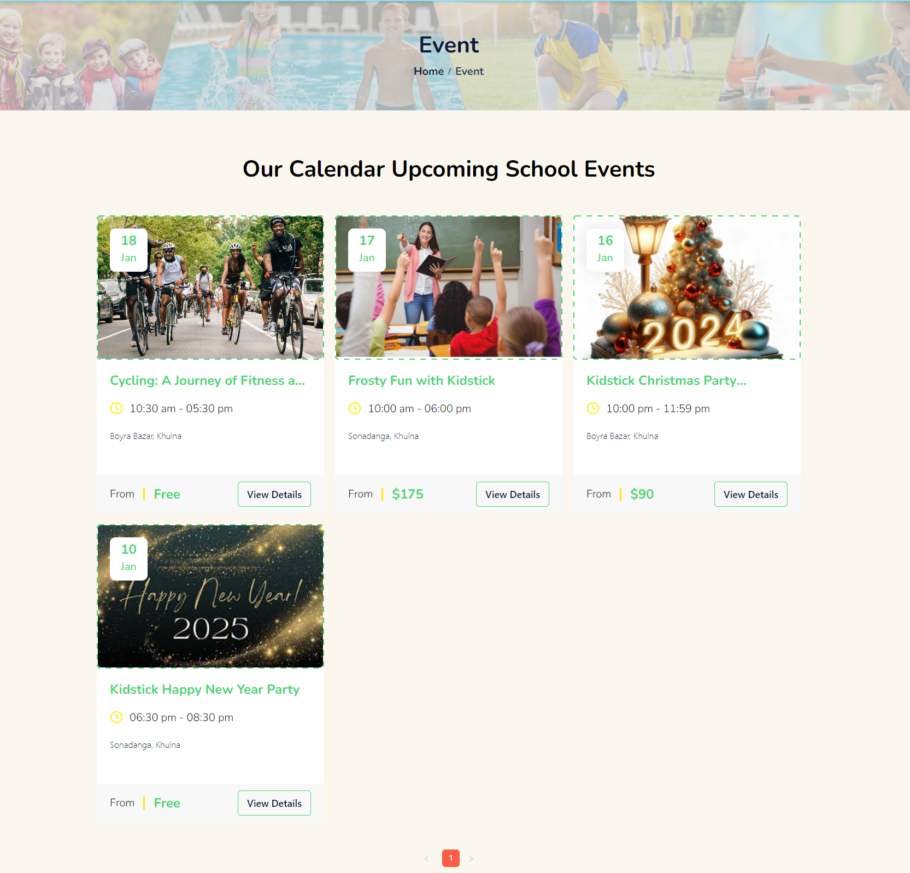
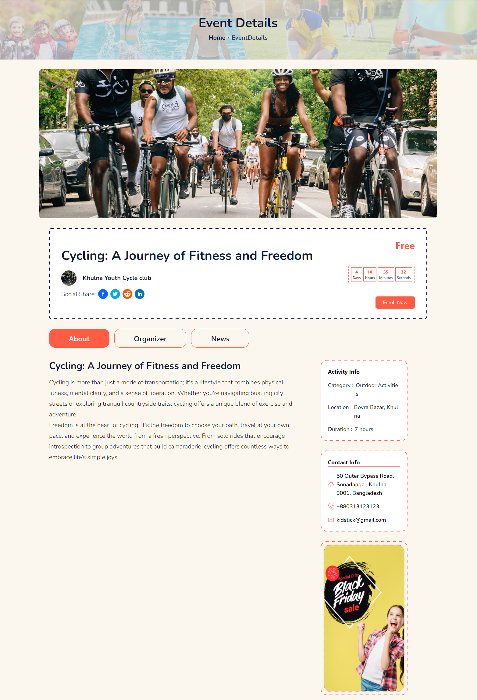
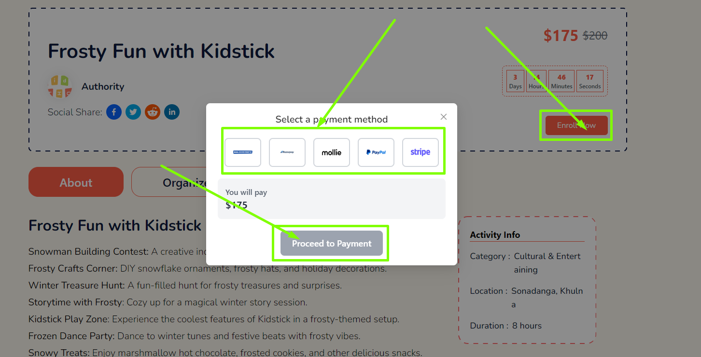
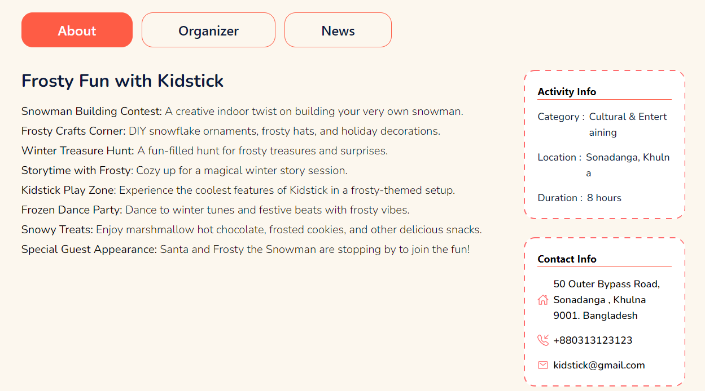
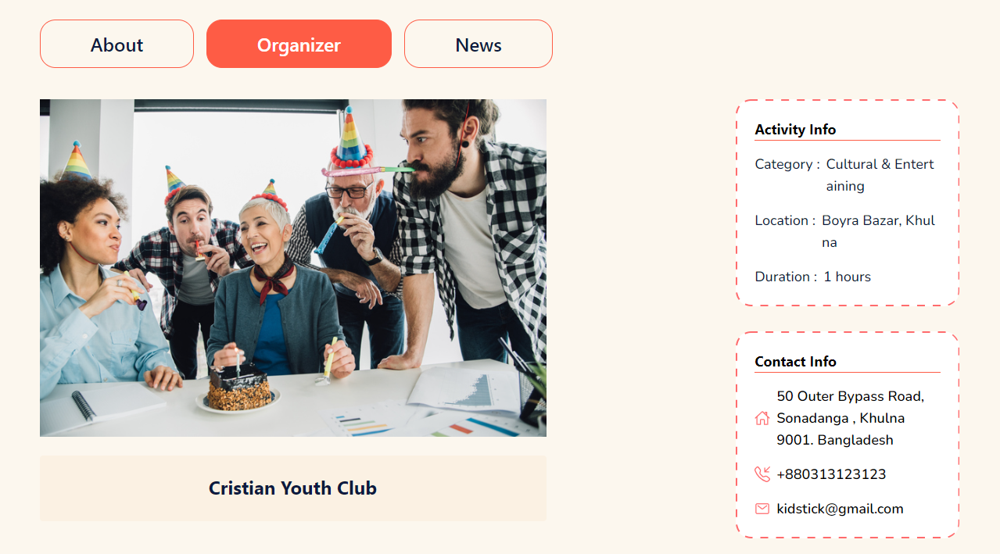
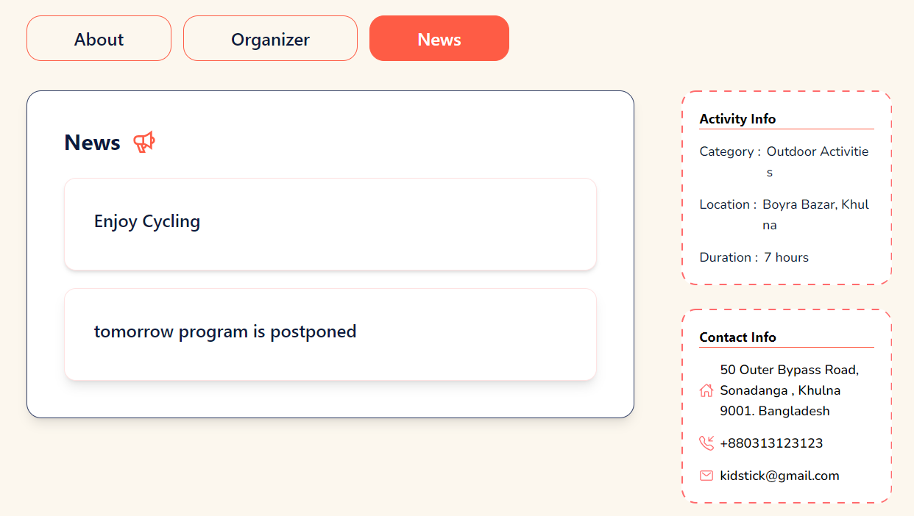

# Event

- In this section, anyone can see the event section photo and content, here all the sections are dynamic.

- You can change it according to your requirement.

- The admin can modify it through the **Event** page in the admin panel.

## Here is how to see the event details!

- Click on the **View Details** button to see the event details.

- In this section, anyone can see the event details section photo and content, here all the sections are dynamic.

- Admin can change it according to his requirement.

- The admin can modify it through the **event** page in the admin panel.

## Here is how to enroll for the event!

- Click on the **Enroll Now** button to enroll for the event.

- A modal will appear where you can select the payment method.

### About Event

- In this section, anyone can see the about section content, here all the sections are dynamic.

- Admin can change it according to his requirement.

- The admin can modify it through the **event** page in the admin panel.

### Organizer tab

- In this section, anyone can see the organizer section content, here all the sections are dynamic.

- Admin can change it according to his requirement.

- The admin can modify it through the **event** page in the admin panel.

### News tab

- In this section, anyone can see the news section content, here all the sections are dynamic.

- Admin can change it according to his requirement.

- The admin can modify it through the **event** page in the admin panel.

