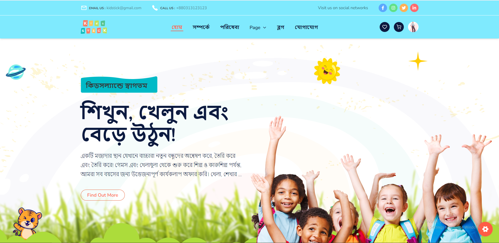
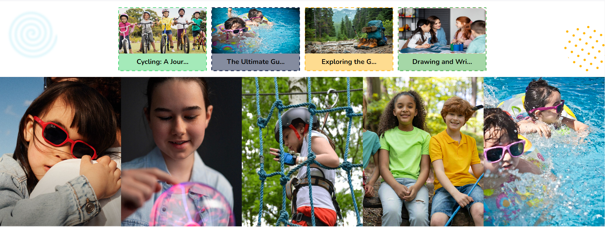
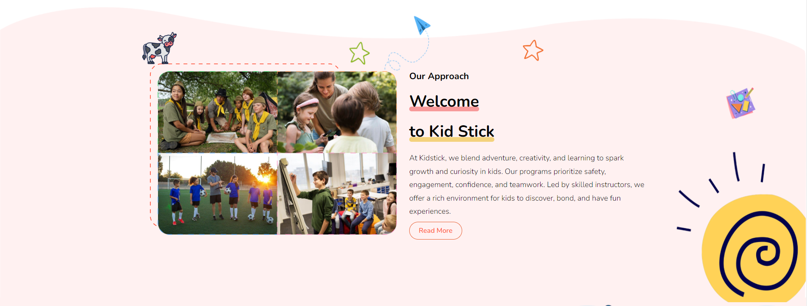
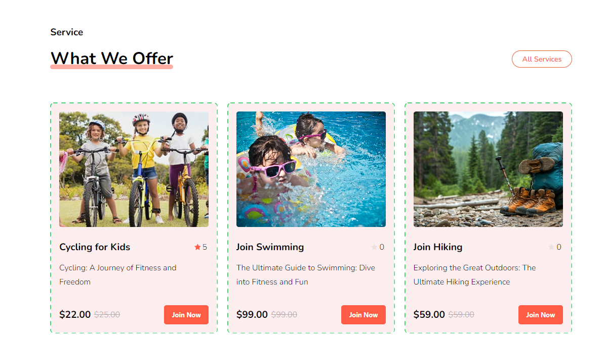
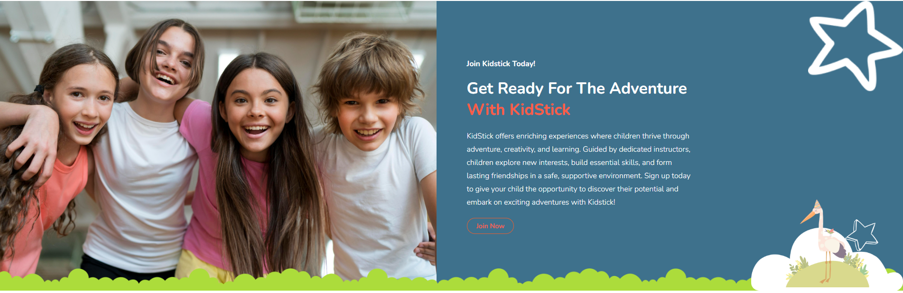
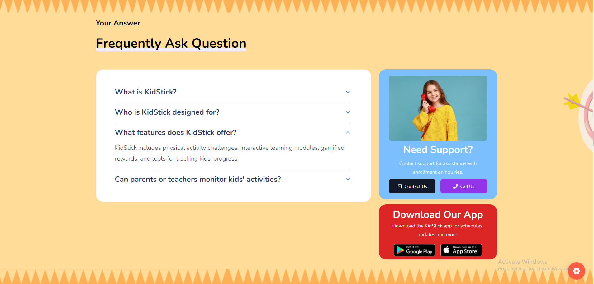
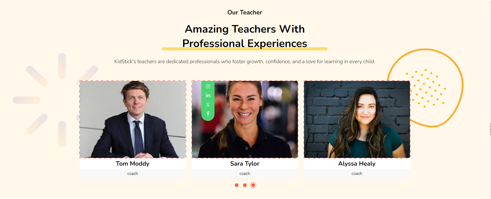
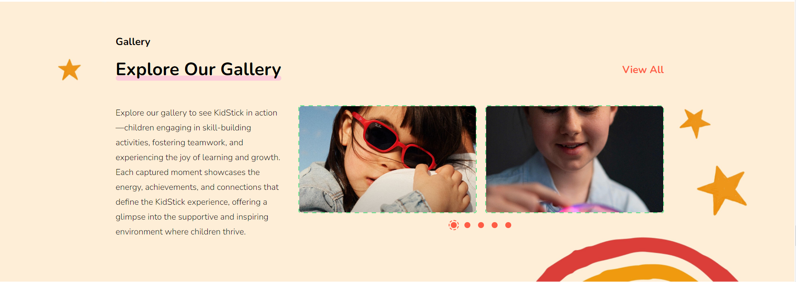
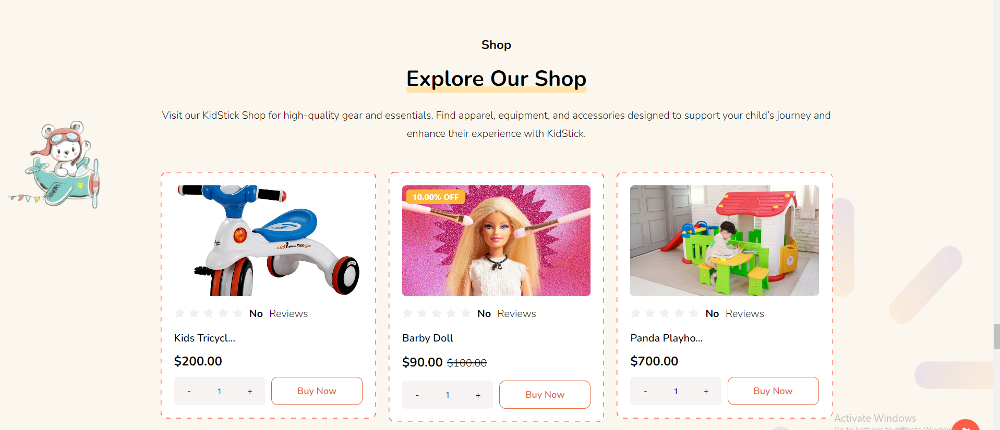
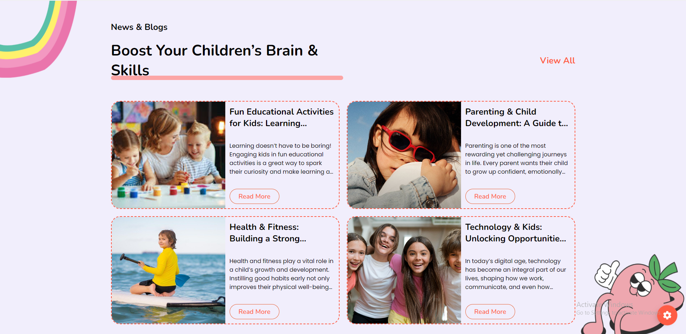

# Home

- In this section, the admin will be able to see home page and all the existing sections and their key information.

- Admin can change it according to his requirement.

# Services & gallery

- In this section, the admin will be able to see all the existing services and their key information.

- Admin can change it according to his requirement.

- Admin can add see the services in the **services** page in the admin panel .

- Admin can add see the gallery in the **gallery** page in the admin panel .

# Approach

- In this section, the admin will be able to see all the existing approach and their key information.

- You can see that what our approach is .

- Admin can change it according to his requirement.

- Admin can add see the approach in the **page setting** page in the admin panel .

- The **Read more** button will take you to the service page to show all the services.

!

## Overview

- In this section, anyone can see the overview section photo and content, here all the sections are dynamic.

- You can change it according to your requirement.

- The admin can modify it through the **page setting** page in the admin panel.

# Services

- In this section, anyone can see the services section photo and content, here all the sections are dynamic.

- You can change it according to your requirement.

- The admin can modify it through the **Services** page in the admin panel.

- Click on the **All Services** button to see all the services.

# Choose Us

- In this section, anyone can see the choose us section photo and content, here all the sections are dynamic.

- You can change it according to your requirement.

- The admin can modify it through the **page setting** page in the admin panel.

- Click on the **Join now** button to see all the services to join us.

## Event 

- In this section, anyone can see the event section photo and content, here all the sections are dynamic.

- You can change it according to your requirement.

- The admin can modify it through the **Event** page in the admin panel.

# Join Us 

- In this section, anyone can see the join us section photo and content, here all the sections are dynamic.

- You can change it according to your requirement.

!

## Review

- In this section, anyone can see the review section photo and content, here all the sections are dynamic.

- You can change it according to your requirement.

- The admin can modify it through the **Testimonial** page in the admin panel.

# FAQ

- In this section, anyone can see the faq section photo and content, here all the sections are dynamic.

- You can change it according to your requirement.

- The admin can modify it through the **FAQ** page in the admin panel.

# Our Teacher

- In this section, anyone can see the our teacher section photo and content, here all the sections are dynamic.

- You can change it according to your requirement.

- The admin can modify it through the **Coach** page in the admin panel.

# Enrolling Now

- In this section, anyone can see the enrolling now section photo and content, here all the sections are dynamic.

- You can change it according to your requirement.

- The admin can modify it through the **page setting** page in the admin panel.

# Price

- In this section, anyone can see the price section photo and content, here all the sections are dynamic.

- Admin can change it according to his requirement.

- The admin can modify it through the **package** page in the admin panel.

# Gallery

- In this section, anyone can see the gallery section photos , here all the sections are dynamic.

- Admin can change it according to his requirement.

- The admin can modify it through the **Gallery** and **page setting** page in the admin panel.

# Shop

- In this section, anyone can see the shop section photo and content, here all the sections are dynamic.

- Admin can change it according to his requirement.

- Click on the product title to see the product details.

- Click on the **All products** button to see all the products.

- The admin can modify it through the **Shop** page in the admin panel.

# Blog & News

- In this section, anyone can see the blog & news section photo and content, here all the sections are dynamic.

- Admin can change it according to his requirement.

- The admin can modify it through the **Blog** page in the admin panel.

- Click on the **Read more** button to see the blog details.

# Contact

- In this section, anyone can see the contact section photo and content, here all the sections are dynamic.

- Admin can change it according to his requirement.

- The admin can modify it through the **page setting** page in the admin panel.

- The admin can add see the contact information in the **contact** page in the admin panel .

