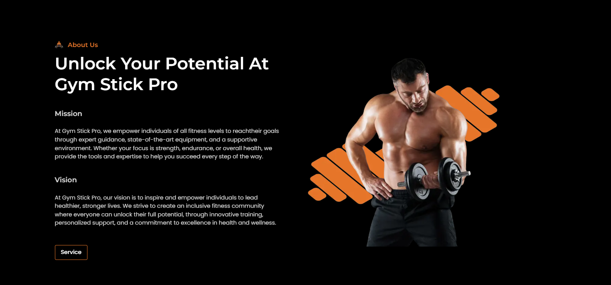
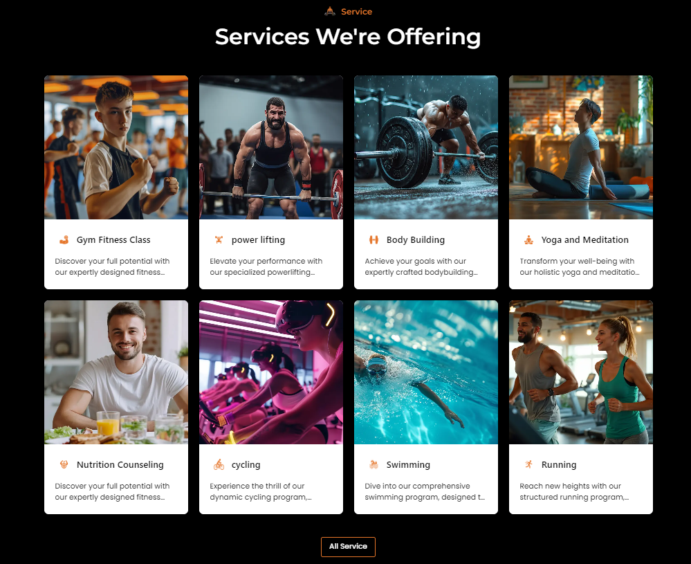
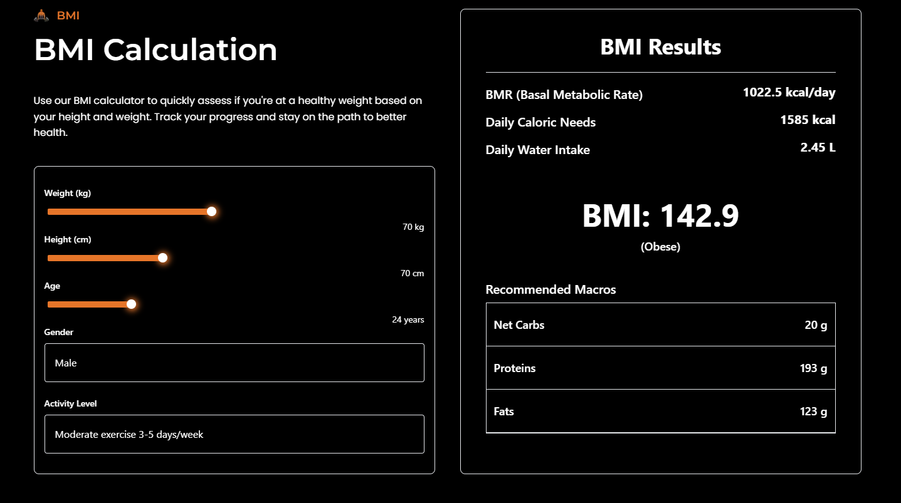
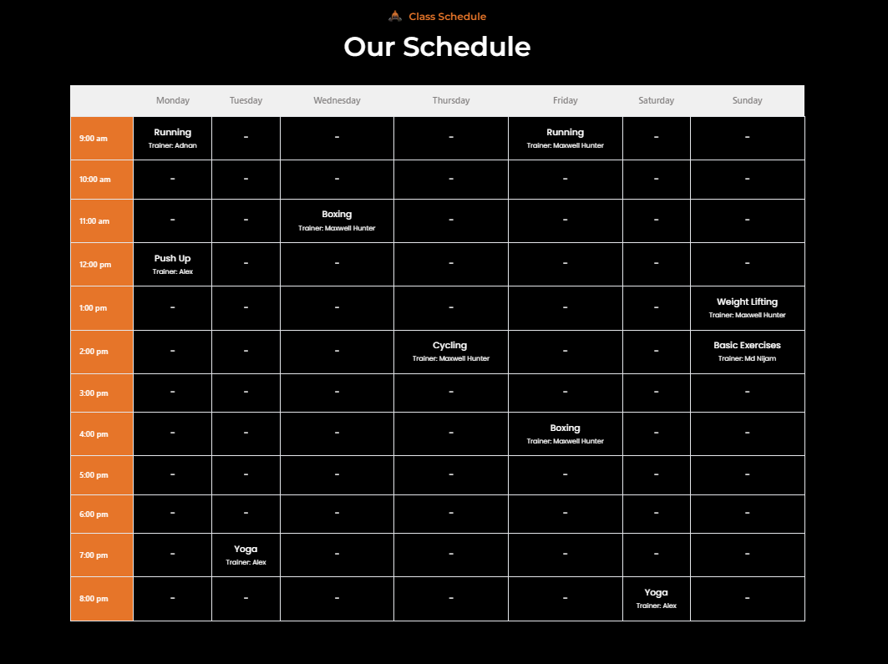

# Home 3

## Hero Section

- In this section, uses can see the hero section with video and content, here all the sections are dynamic.
- Admin can change it according to his requirement.
- To clicking the **Start your journey** button to go to the services page and see all services.
- To clicking the **Contact Us** button to go to the contact page and you can contact with us.

<!--  -->

## About Us
- In this section, users can see the about us section with photo and content, here all the sections are dynamic.
- Admin can change it according to his requirement.
- To clicking the **service** button to go to the services page and see all services.

<!--  -->

## Services

- In this section, uses can see the services section photo and content, here all the sections are dynamic.
- Admin can change it according to your requirement.
- To clicking the service name to go to the Service detail page.
- To clicking the **All Service** button to go to the services page and see all services.

<!--  -->

## BMI
- In this section, in here uses can calculate their BMI according to their height, age and weight.

<!--  -->

## Class Schedule

- In this section, uses can see the class schedule , here all the sections are dynamic.

- Admin can change it according to his requirement.

<!--  -->