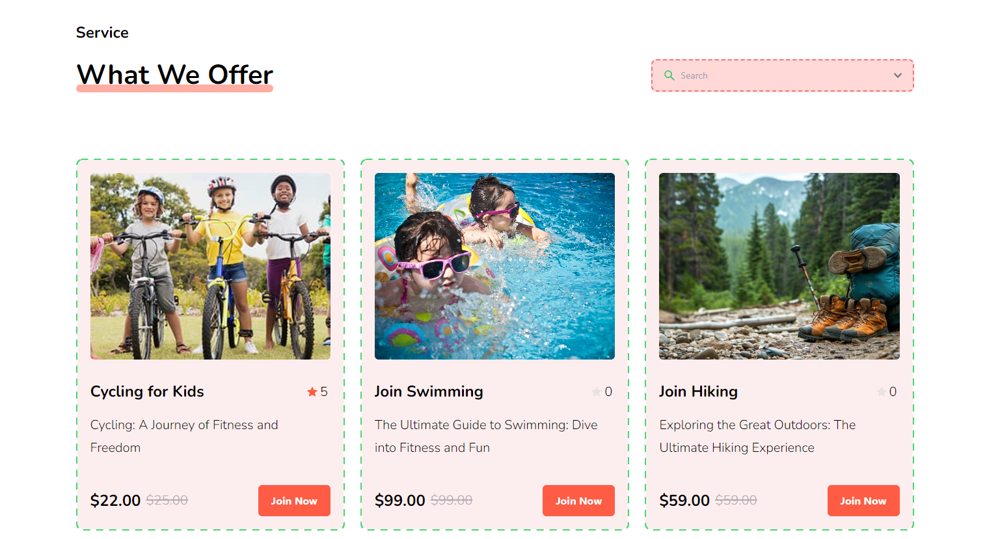
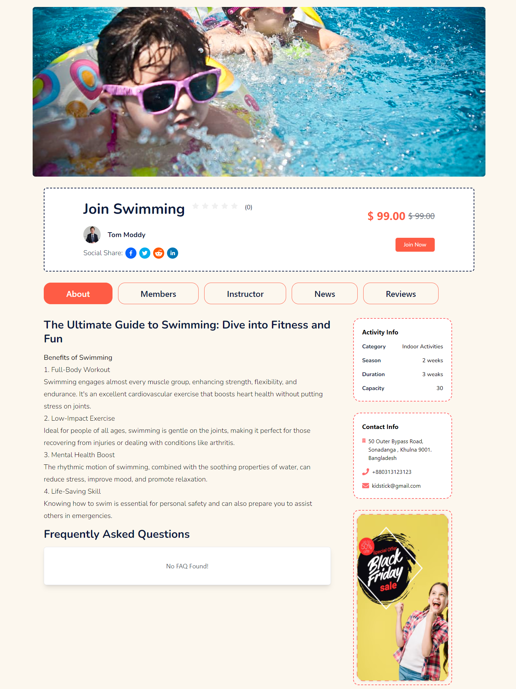
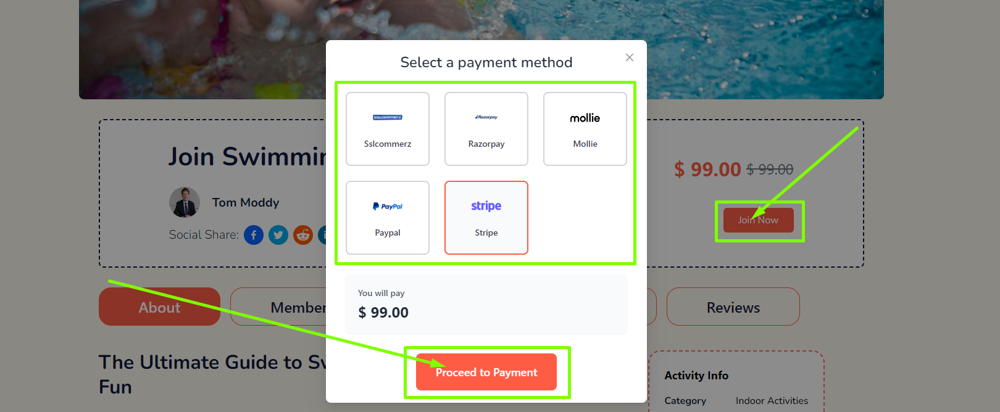
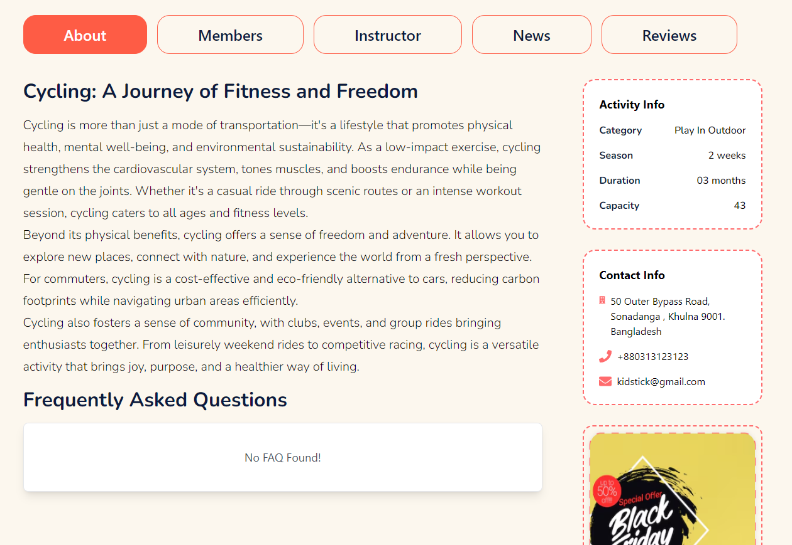
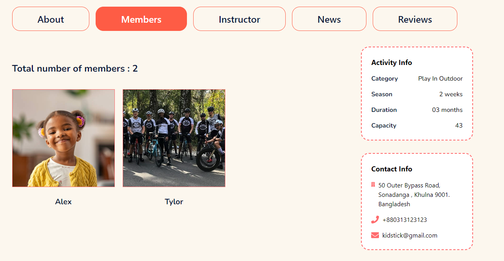
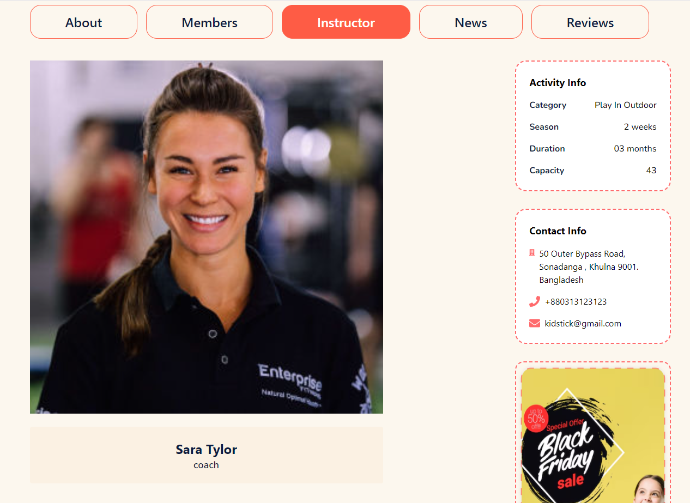
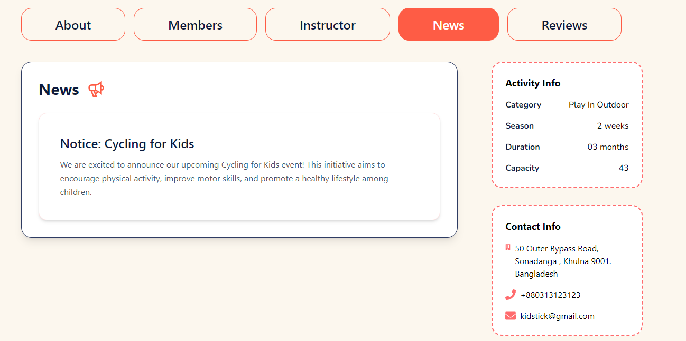
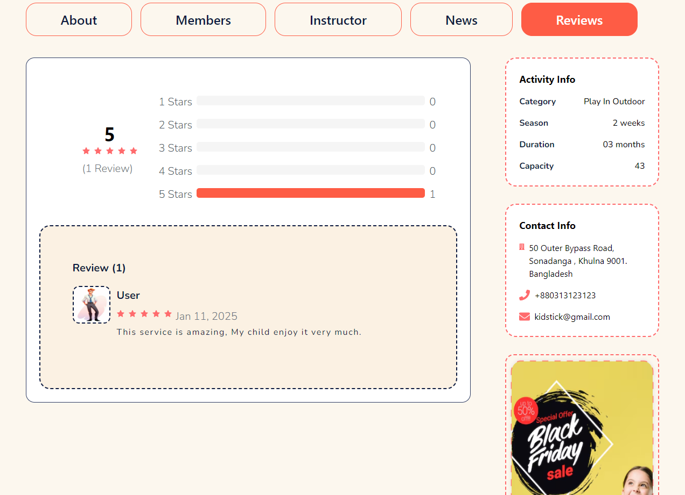

# Services

- In this section, anyone can see the services section photo and content, here all the sections are dynamic.

- Admin can change it according to his requirement.

- The admin can modify it through the **Services** page in the admin panel.

- Anyone can search the services by using the **search bar**.

- Click on the any **Services** to see the service details.

# Service Details

- In this section, anyone can see the service details section photo and content, here all the sections are dynamic.

- Admin can change it according to his requirement.

- The admin can modify it through the **Services** page in the admin panel.

### Here is how to join any service?

- Click on the **Join Now** button .

- A modal will appear where you can select the payment method.

### About tab

- In this section, anyone can see the about section content, here all the sections are dynamic.

- Admin can change it according to his requirement.

### Member tab

- In this section, anyone can see all of the members joined the service, here all the sections are dynamic.

- User can add there kids to the service.

### Instructor tab

- In this section, anyone can see that who is the instructor of the service, here all the sections are dynamic.

- Admin can assign the instructor to the service.

### News tab

- In this section, anyone can see the service news and updates, here all the sections are dynamic.

- Admin and coach can add the news and updates to the service.

### Reviews tab

- In this section, anyone can see the service reviews, here all the sections are dynamic.

- User can add the reviews to the service.

# Price

- In this section, anyone can see the price section photo and content, here all the sections are dynamic.

- Admin can change it according to his requirement.

- The admin can modify it through the **package** page in the admin panel.

# Contact

- In this section, anyone can see the contact section photo and content, here all the sections are dynamic.

- Admin can change it according to his requirement.

- The admin can modify it through the **page setting** page in the admin panel.

- The admin can add see the contact information in the **contact** page in the admin panel .

