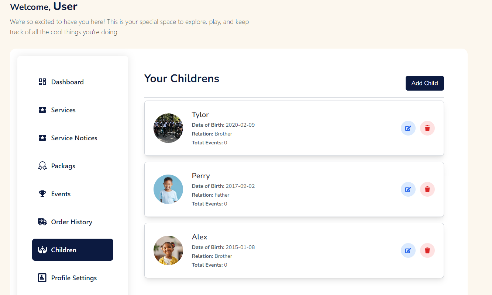
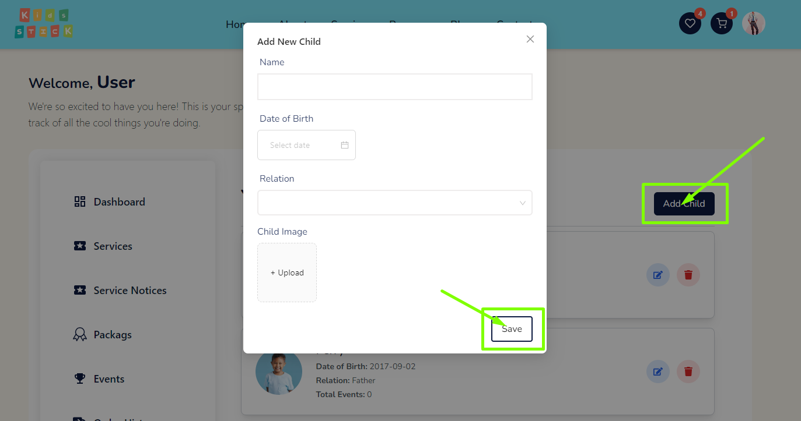
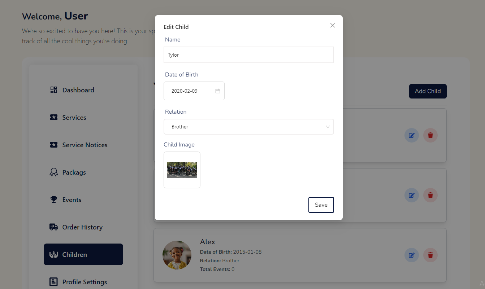
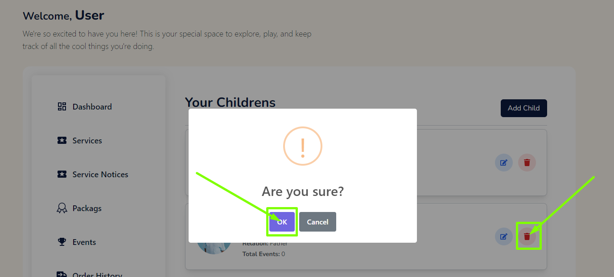

# Children

- In this section, the user will be able to see all the existing children that user has added.

## Here is how you can add a child!

- The user can add a child by clicking the **Add Child** button.

- A modal will appear where you can enter the details of the child.

- Fill the details and click on the **Save** button to add the child.

## Here is how to edit a child!

- To edit a child, click on the **Edit** action button.

- To change the details of the child, fill the required fields and click on the **Save** button to save the changes.

## Here is how to delete a child!

- To delete a child, click on the **Delete** action button.

- A confirmation dialog will appear where you can confirm the deletion of the child.

