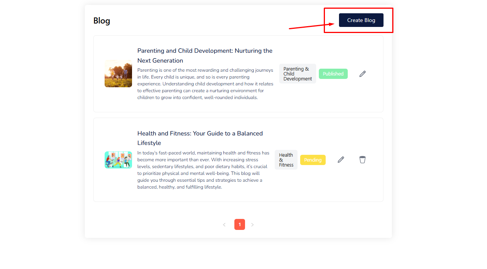
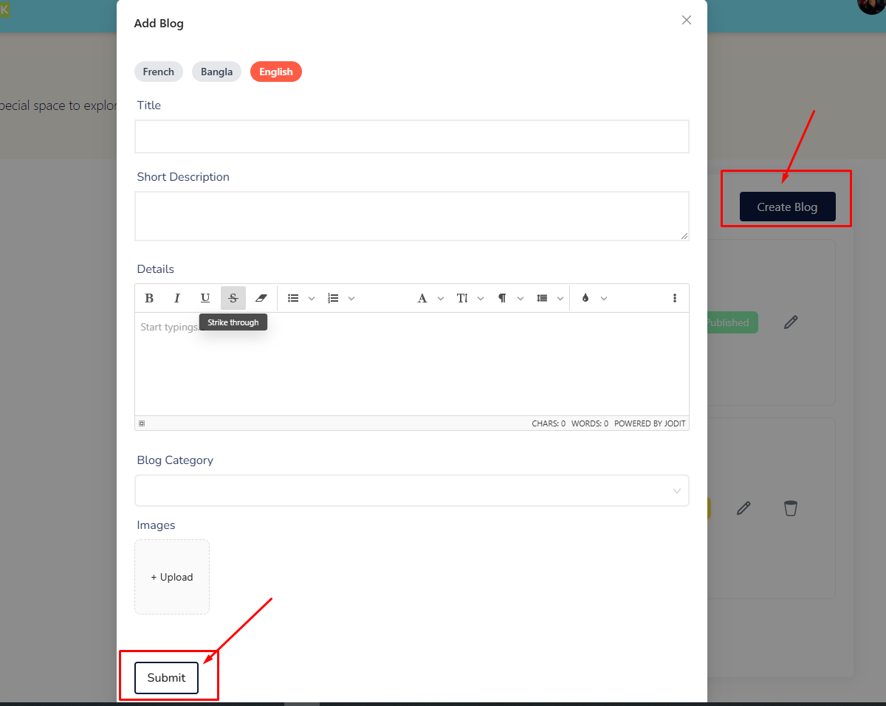
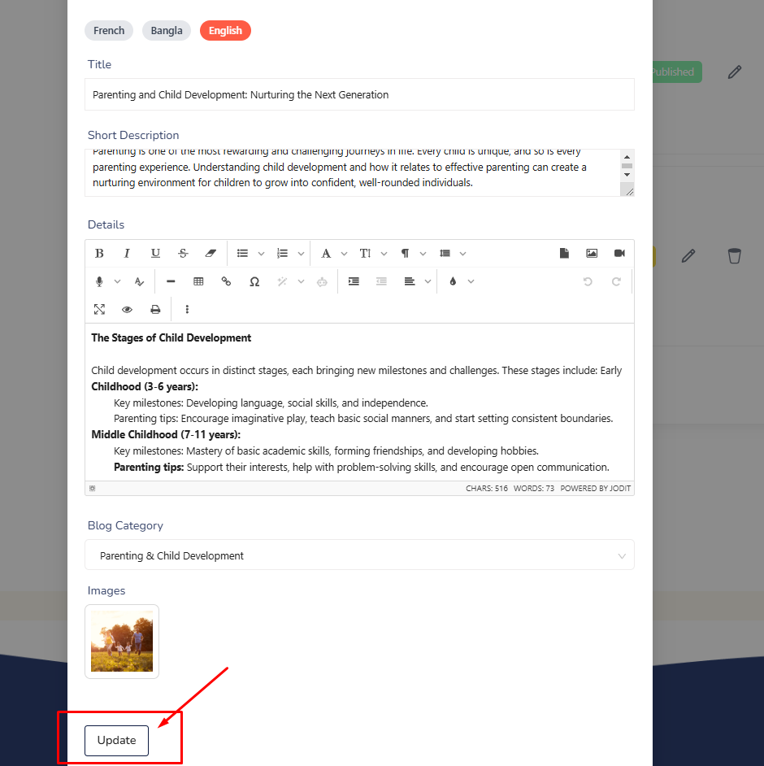

# Blog

- In this section, the coach can create blog posts for the site.

- In this section, the coach will be able to see all the existing blogs. In initial view, the blog will be pending for approval. After approval, the blog will be displayed on the site.

<!-- image -->

<!-- image -->
# Here is how to add a new blog !

- To add a new blog, click on the **Create Blog** button.

- A form will appear where coach can add a new blog. After adding the blog, click on the **Submit** button to Submit the blog.

 
<!-- image -->
# Here is how to view a blog detail !

- To view a blog detail, click on the **View** action button.

- A form will appear where you can view the blog detail.

<!-- image -->
# Here is how to edit and delete a blog !

- To edit a blog, click on the **Edit** action button. A form will appear where coach can edit the blog. After editing the blog, click on the **Update** button to Submit the blog.

- To delete a blog, click on the **Delete** action button. A modal will appear where coach can delete the blog.

<!-- image -->