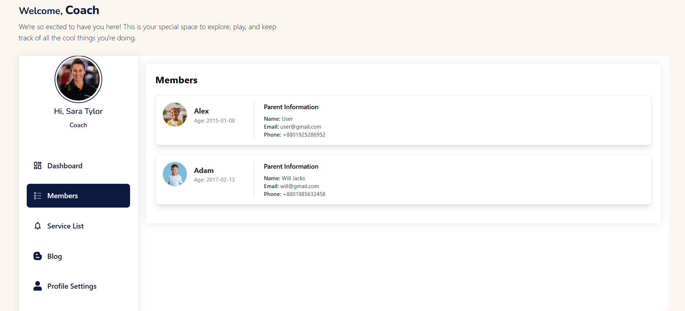

# Member

- The member section allows coaches to assign members to services.

- In this section, the coach will be able to see all the existing members that user has enrolled for a specific service.

<!-- image -->

- In here coach can see the member details.